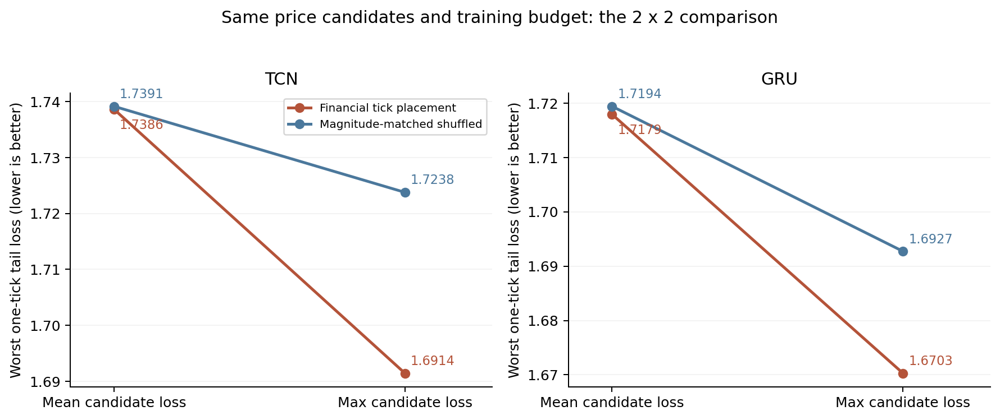

# 한국 USDT 위험 측정과 기준 코인의 호가 구조

> **새 연구 브랜치 — 2026-09-24:** 기존 국내 원고의 회귀 잔차를 유지하면서 공통 요인의 비선형 관계와 포지셔닝의 추가 정보를 다시 검토합니다. [새 연구 안내](experiments/nonlinear_residual/README.md) · [실험 규칙](experiments/nonlinear_residual/PROTOCOL_KO.md). 아래는 이전 호가·AI 연구의 보존 기록입니다.

> **새 연구 최신 결과:** [A5 — 잔차 RMSE의 의미와 공통 요인·후속 위험 분석의 종합 비교](experiments/nonlinear_residual/evaluation_audit/RESULTS_KO.md). [문헌의 실제 평가 방식](experiments/nonlinear_residual/evaluation_audit/LITERATURE_KO.md), 동일 미래 목표 예측, 분해 모형을 다시 학습하는 불확실성 검증을 포함합니다. [A4의 비선형 요인 실험](experiments/nonlinear_residual/latent_factors/RESULTS_KO.md)도 보존합니다.

**워크숍 1안의 원자료 → 전처리 → 측정·평가 → AI 학습 → 검증 결과를 모은 연구 저장소입니다.** 최초 분석과 수정 과정, 개선되지 않은 실험, 최신 TCN·GRU 통제 실험을 함께 보존합니다. 연구 기록 기준일은 **2026-09-11**입니다.

**바로 읽기:** [연구 흐름](docs/STUDY_GUIDE_KO.md) · [데이터와 전처리](docs/DATA_KO.md) · [최신 결과](docs/research/option1_factorial_20260910/RESULTS_KO.md) · [재현 방법](docs/REPRODUCING.md) · [검증 기록](provenance/PACKAGE_VERIFICATION.json)

## 연구 질문

한국 USDT의 상대가격 괴리를 측정할 때, 비교 기준으로 사용하는 코인의 상대 호가 크기가 위험 판정과 예측 평가를 얼마나 바꾸는가? 이 금융 구조를 학습에 반영하면 원래 예측 정확도의 훼손을 제한하면서 작은 가격 변화에 대한 취약성을 줄일 수 있는가?

각 기준 코인의 상대가격 괴리는 다음과 같습니다.

```text
b_i = 10000 × log(Upbit_USDT_KRW × Binance_i_USDT / Upbit_i_KRW)
mean5 = BTC·ETH·XRP·SOL·DOGE의 b_i 평균
```

이 목표는 USD 디페깅의 참값이나 실현 투자수익률이 아닙니다. 국내 제출 원고의 기존 OLS 잔차와 최신 상대가격 목표를 구분합니다.

## 현재 핵심 결과

1. **측정:** 기준 코인별 상대 호가 크기가 달라 같은 한 호가 변화에도 위험 판정과 예측 평가가 민감하게 달라졌습니다. 동일한 bp 변화 대조에서는 다른 양상이 나타났습니다.
2. **평균 학습:** 금융 호가 후보를 평균적으로 학습하는 것만으로 얻은 예측·스트레스 손실 개선은 작거나 없었습니다.
3. **어려운 사례 학습:** 금융 호가 후보와 최대 손실 학습을 결합하면 한 호가 입력 변화가 더하는 손실을 줄였습니다. 후보·학습량·무작위 요소를 통제한 TCN과 GRU 모두에서 결합 효과를 확인했습니다.

최신 실험은 **96개 월별 적합**, 동일한 **1,814개 예측 시점·관측일 77일**, 세 초기값 앙상블을 사용합니다.

| 같은 금융 후보에서 평균 → 최대 손실 학습 | TCN | GRU |
|---|---:|---:|
| 원래 예측 손실 변화 | +0.0016% | +0.0904% |
| 주 스트레스 손실 감소 | 2.71% | 2.77% |
| 예측 흔들림 감소 | 72.60% | 76.72% |

금융 후보와 최대 손실 학습의 상호작용은 두 구조 모두 Holm19 **p=0.0095**입니다. 선형 QR 대비 주 스트레스 손실 감소는 TCN **4.63%**, GRU **5.82%**였으며, 사전 고정한 **10% 감소 목표에는 미달**했습니다. 원래 정확도의 2% 비열등성 기준은 통과했으나 정확도 우위를 확정하지 못했습니다.



주 스트레스 손실은 원래 입력과 최신 한 시간의 코인별 ±1호가 후보 중 최악의 q10·q90 평균 pinball loss입니다. 미래 정답은 실제 6시간 뒤의 같은 값으로 고정합니다. 두 그래프의 세로축 범위가 다르므로 선의 각도로 모델 간 효과 크기를 비교하지 않습니다.

## 처음부터 끝까지 읽는 순서

아래 폴더는 모두 `research/` 아래에 있습니다. 문서 링크는 GitHub에서 그림·표·코드를 따라갈 수 있는 사본으로 연결됩니다.

| 단계 | 폴더 | 내용과 결과 |
|---|---|---|
| 출발점·감사 | `reference/` | [국내 제출 원고와 기존 코드·수치 대조](docs/research/reference/audit_20260908/REVIEW_KO.md) |
| 원자료 확인 | `data/raw data/` | [복구 자료와 전처리 확인](docs/context/audit_20260908/raw_data_review/REVIEW_KO.md), [데이터 안내](docs/DATA_KO.md) |
| 가격·시간 수정 | `reanalysis_20260909/` | [가격 환산·시간대별 재계산과 문헌 재검토](docs/research/reanalysis_20260909/RESEARCH_REASSESSMENT_KO.md) |
| 첫 예측 실험 | `pilot_20260909/` | [새 상대가격 목표, 초기 모델 비교와 한계](docs/research/pilot_20260909/RESULTS_KO.md) |
| 1안 기본 확장 | `extension_20260909/` | [여러 목표·시계, 정보 비교, 보정·민감도](docs/research/extension_20260909/RESEARCH_FINDINGS_KO.md) |
| 호가 구조 탐색 | `option1_development_20260909/` | [한 호가 민감도와 초기 제도 비교](docs/research/option1_development_20260909/DEVELOPMENT_PLAN_KO.md) |
| 핵심 실증 | `option1_core_20260909/` | [사전 추세·통제 회귀·경제적 계수 비교](docs/research/option1_core_20260909/RESULTS_KO.md) |
| 측정·평가 확장 | `option1_resolution_20260910/` | [상대 호가 크기, 위험 판정, 고정 예측 평가](docs/research/option1_resolution_20260910/RESULTS_KO.md) |
| 첫 AI 확장 | `option1_tick_learning_20260910/` | [금융·무작위 증강 TCN과 선형 비교](docs/research/option1_tick_learning_20260910/RESULTS_KO.md) |
| 모델·학습 후속 | `option1_model_followup_20260910/` | [GRU·MLP 및 어려운 호가 사례 TCN](docs/research/option1_model_followup_20260910/RESULTS_KO.md) |
| **최신 통제 실험** | **`option1_factorial_20260910/`** | [**금융/무작위 후보 × 평균/최대 손실 × TCN/GRU**](docs/research/option1_factorial_20260910/RESULTS_KO.md) |

각 단계에 코드, 프로토콜·설정, 중간 자료, 점수·검정 CSV, 그림, 검증 기록이 있습니다. AI 단계에는 저장된 가중치와 시점·후보별 예측 배열도 있습니다. 초기 영어 [워크숍 초안](docs/research/extension_20260909/WORKSHOP_DRAFT.md)은 당시의 초안이며, 최신 AI 결과까지 반영한 최종 원고가 아닙니다.

## 다운로드와 빠른 검증

큰 예측 배열 두 개는 **Git LFS**로 저장합니다. Git과 Git LFS가 설치된 환경에서 실행합니다.

```bash
git lfs install
git clone https://github.com/SOOBEENKIM/stablecoin.git
cd stablecoin
git lfs pull
python3 scripts/verify_archive.py
```

마지막 검사는 추가 Python 패키지 없이 원본 연구 파일과 대용량 파일의 실제 내용·SHA-256을 확인합니다. GitHub의 일반 ZIP 다운로드에 실제 LFS 내용이 포함되는지에 의존하지 않고, 위 방법으로 받아 검증하는 것을 권합니다. [GitHub LFS 안내](https://docs.github.com/en/repositories/working-with-files/managing-large-files/about-git-large-file-storage).

Python 분석 환경을 준비한 뒤에는 다음과 같이 원자료 전처리와 최신 결과 재계산을 실행합니다.

```bash
python scripts/reproduce.py prepare-data
python scripts/reproduce.py latest-analysis
```

실행 결과는 `.runs/`의 별도 작업 사본에 저장됩니다. 저장소의 과거 연구 파일은 보존됩니다. 모델 재학습, Docker 환경, 전체 단계별 명령은 [재현 안내](docs/REPRODUCING.md)를 따릅니다.

## 무엇이 포함되어 있는가

```text
research/       원자료·전처리·모든 연구 단계의 코드와 결과, 체크포인트·그림
docs/           연구 흐름·데이터·재현 설명, GitHub용 보고서 사본
context/        원자료 복구와 이전 자료 판별의 감사 기록
scripts/        체크섬 검증, 별도 사본에서 실행하는 재현 명령, 문서 변환
environments/   Python 패키지 버전과 CPU 신경망 Dockerfile
provenance/     파일 목록·체크섬·대용량 파일 정보·패키지 검증 기록
```

`research/`의 **917개 파일은 원본과 바이트 단위로 같습니다.** 일부 이전 검증이 2안·3안 파일도 보존 검사하므로 해당 폴더를 역사적 보조 자료로 포함했습니다. 이를 1안 결과로 합산하지 않으며, 3안의 모델 학습은 진행하지 않았습니다.

캐시 파일과 내려받은 외부 논문 전체 PDF·텍스트는 제외하고, 인용과 공식 출처 링크를 남겼습니다. 해당 목록은 [제외 기록](provenance/excluded_files.json)에 있습니다. 원자료를 제거한 것은 아닙니다. 데이터 제공자와 기존 자료의 출처는 [데이터 안내](docs/DATA_KO.md)를 따릅니다.

## 해석의 범위

같은 짧은 역사적 평가 기간을 반복 사용한 탐색 연구입니다. 경제적 계수 차이의 주 검정 24개는 다중검정 보정 후 모두 비유의였고, 포지셔닝 채널이 확인됐다고 주장하지 않습니다. 최신 통제 구현은 앞선 hard TCN의 더 큰 원래 정확도 개선을 그대로 재현하지 못했습니다.

입력 강건성이 미래 목표 자체의 측정 불확실성을 없애지는 않습니다. 이 결과에서 시장 인과효과, 참가격 복원, 실현 수익, 알고리즘의 최초성이나 워크숍 채택을 주장하지 않습니다. 원고·프로토콜의 작성 시점과 현재 결론을 구분하는 방법은 [보존 기록 안내](docs/ARCHIVE_NOTES.md)에 있습니다.
