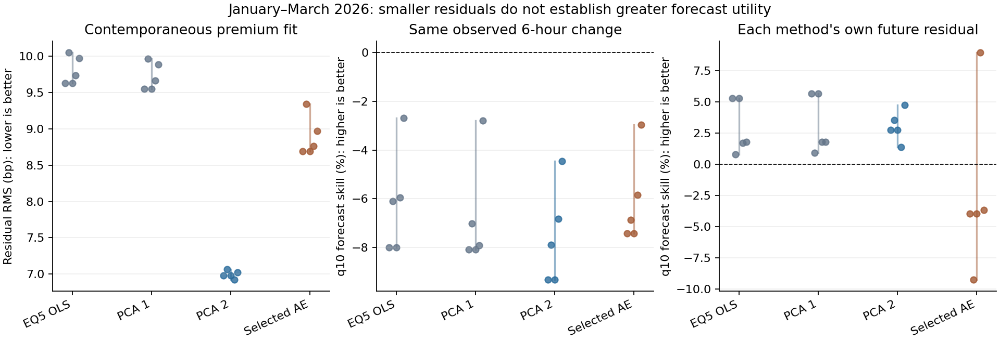

# A5: RMSE만으로 분해 방법을 선택하지 않는 종합 평가

**기존 RMSE는 ‘남은 잔차의 크기’다. 진짜 USDT 고유 성분을 알고 비교한 오차가 아니다.** PCA2가 이 값에서는 우수하지만 경제적 분리의 정답이라는 뜻은 아니다. ML도 이 값만으로 탈락시키지 않고, 잔여 기준 자산 정보·같은 미래 관측 목표·원래 연구의 관계와 불확실성을 추가 비교했다.

## 1. 무엇의 RMSE인가

`y_t = 관측된 한국 USDT 프리미엄`, `f_hat(X_t) = 해당 월 이전 자료로 학습한 모형이 현재 기준 자산/상대가격 정보로 설명한 부분`이다.

```text
e_t = y_t - f_hat(X_t)
기존 RMSE = sqrt(mean(e_t^2))
```

예를 들어 실제 저장 자료의 2026-01-01 20:00 UTC에서 y는 85.618bp다. EQ5 순차 회귀의 설명값은 72.955bp, 잔차는 12.663bp이고, PCA2 설명값은 82.969bp, 잔차는 2.649bp다. 이런 잔차를 평가 시점 전체에서 제곱해 평균하고 제곱근을 취했다. **PCA2가 더 많은 부분을 설명한 것은 확인할 수 있지만, 실제 USDT 고유 성분이 2.649bp였는지는 알 수 없다.** [시나리오별 실제 예시](results/rmse_examples.csv).

현재 기준 가격 X_t를 사용하는 동시점 설명이다. 미래 예측과 구분한다. AE가 기준 코인 5종을 얼마나 복원하는지의 재구성 MSE도 별도 지표다. 이 값과 USDT 잔차 RMS를 섞지 않는다.

## 2. 분해 방법 자체의 차이

| 방법 | 기준 요인을 만드는 방법 | USDT에서 제거하는 방법 |
|---|---|---|
| EQ5 선형 | 5종 김프의 동일가중 평균 1개 | y를 평균 김프에 OLS, 남은 값에 g를 순차 OLS |
| PCA1 | 표준화한 5종 김프의 첫 번째 선형 주성분 | 표준화 요인에 Ridge(alpha=1), 남은 값에 g를 OLS |
| PCA2 | 첫째·둘째 선형 주성분 | 같은 Ridge와 g 조정 |
| 선택 AE | 5종 김프를 재구성하는 비선형 신경망의 1/2차원 잠재좌표 | 같은 Ridge와 g 조정; 구조/규제는 과거 검증자료로 선택 |
| joint OLS 진단 | EQ5 평균과 g | y에 두 변수를 동시에 회귀 |

g는 USDCUSDT 상대가격의 1 대비 절대 이탈이다. USDC/USD=1 가정하의 proxy이며 진짜 USDT/USD 디페깅 관측값은 아니다. PCA는 **선형** 차원 축소다. AE가 기준 코인 사이의 비선형 구조를 학습하는 것과 평균 김프→USDT 회귀함수를 비선형으로 바꾸는 A1–A3는 서로 다른 실험이다.

순차 회귀에서 두 입력이 상관되어 있으면 g 조정 후 평균 김프와의 직교성이 다시 깨질 수 있다. 그래서 joint OLS도 통제군으로 추가했다. 훈련표본에서 상관계수가 0이라는 사실만으로 분해가 옳다고 평가하지 않았다.

## 3. 이번에 실제로 비교한 결과

2026년 1–3월 동일 관측 시점을 사용했다. 각 월 이전 자료만 학습했고, 미래 예측 학습의 목표 시각도 해당 월 시작 전으로 제한했다. 다섯 시각 가정 중 UTC 두 경우의 core 입력은 같아 독립 반복이 아니다. 모든 범위는 시간 정렬 시나리오의 범위다.

자료 종료일까지의 분해 평가 표본은 906–912개 시점, 정확한 6시간 뒤 예측은 576–577개, 세 시차 공통 origin은 228–229개다. FX 등 자료 결측 후 남은 행을 이어 붙여 ‘6행 뒤’를 6시간 뒤로 처리하지 않았다.

| 평가 | 결과 | 해석 |
|---|---|---|
| 동시점 잔차 RMS | EQ5 9.63–10.05bp, PCA1 9.55–9.97bp, PCA2 6.93–7.06bp, 선택 AE 8.69–9.35bp | 가격 설명 기준에서는 PCA2가 우수 |
| EQ5/PCA1 잔차의 추가 설명 | 개별 5종 김프+g를 넣은 Ridge가 잔차 0 기준 MSE를 약 45–48% 감소 | 단순 평균/PC1이 담지 못한 **코인 간 차이**가 남음. 전부 공통 요인이라고 단정할 수 없음 |
| PCA2 잔차의 추가 설명 | 고정 Ridge/작은 tree probe가 잔차 0 기준을 넘지 못함 | 이 probe들에서 추가 정보가 확인되지 않음. 독립성이나 참된 고유 성분을 입증한 것은 아님 |
| AE 잔차의 추가 설명 | tree probe 개선은 약 −4.1%~+2.5%; 선형 probe는 과거 월의 불안정에 크게 영향받음 | 안정적인 추가 설명 또는 독립성 결론을 내리기 어려움 |
| 같은 실제 6시간 뒤 프리미엄 변화의 q10 예측 | AE 잔차를 넣은 tree가 PCA2 잔차를 넣은 tree보다 손실이 약 0.9–1.7% 낮음(LS 포함) | 첫 단계 RMSE와 후속 순위가 다를 수 있다는 실제 예. 일부 시나리오 구간은 0을 포함 |
| 위 예측의 절대 유용성 | AE도 과거 변화량의 q10만 사용하는 기준보다 손실이 약 3.0–7.4% 큼(LS 포함 tree) | PCA2보다 나은 조합이 있어도 유용한 위험 예측 개선을 확보한 것은 아님 |
| 각자의 미래 잔차 q10 예측 | 선형 QR의 자체 과거 분위수 대비 개선은 EQ5 약 0.8–5.3%, PCA2 약 1.4–4.7%, AE 약 −9.2–8.9%(LS 제외) | AE의 일관된 우위는 확인되지 않음. 서로 다른 잔차의 raw loss는 순위에 사용하지 않음 |

q50 예측, LS 추가/제외, 선형 QR/quantile LightGBM, 월별 성능, 하회율과 3/7일 paired 구간도 모두 저장했다. 특정 좋은 조합만 선택하지 않았다. 동일 미래 관측 목표의 기본 예측기는 이미 y·기준 5종 김프·g·시장 상태를 알고 있다. 잔차는 같은 정보에서 만든 표현이므로, 여기서 얻는 개선은 정보의 추가보다 표현 방식의 유용성에 가깝다.



점은 다섯 시각 가정의 값, 선은 그 범위이며 신뢰구간이 아니다. 가운데는 LS 포함 quantile LightGBM, 오른쪽은 LS 제외 선형 QR. 가운데는 모든 모델의 목표가 같지만 오른쪽은 각자의 잔차가 목표다. 오른쪽 skill은 자기 과거 분위수 대비 개선이며 참된 고유 성분의 정확도 순위가 아니다.

## 4. RMSE 외에 드러난 안정성과 경제적 해석 문제

**과거 기간까지 확인하면 선택 AE는 불안정하다.** Aug–Mar 전체 월별 out-of-sample 잔차 RMS는 AE 약 48–59bp, EQ5 약 9.6–9.8bp다. 이 구간은 선택에 사용한 과거 검증기간까지 포함한 안정성 진단이지 새로운 독립 검증기간은 아니다. UTC에서 2025년 10월 선택 AE의 평균 잔차가 약 86bp로 커졌다. 좋은 Jan–Mar 수치만으로 전체 절차의 안정성을 주장하면 안 된다.

이 큰 과거 잔차 때문에 과거 평균 기준 probe 개선이 81%처럼 보이는 사례도 있었다. 실제로 0 부근을 예측했을 뿐인 개선을 공통 김프 잔여 성분을 잘 설명한 것으로 해석하지 않도록 **잔차 0 기준을 추가 감사**했다. [실행 중 발견사항](AUDIT_NOTES_KO.md), [두 기준 비교](results/probe_zero_baseline_audit.csv).

PCA2의 두 번째 요인은 A4에서 DOGE와 다른 코인의 대비에 집중되어 있었다. DOGE를 빼고 동일가중 선형 회귀를 해도 잔차 RMS 개선이 비슷했다. 따라서 PCA2의 작은 잔차를 ‘시장 공통 요인을 더 정확히 제거했다’고만 설명하기 어렵다. **시장 공통 움직임과 기준 코인 간 상대적 차이를 추가로 조정한 잔차**로 구분해야 한다. [A4의 전 코인 제외 진단](../latent_factors/RESULTS_KO.md).

## 5. 후속 경제 관계와 재추정 불확실성

동일한 M2에서 하방 변동, 변동성, 수익률, LS, 현재 잔차를 통제했다. h=6 q10/q50 및 동일 origin의 h=1/6/12 q10을 비교했다. 7일 블록 199회에서 표준화·PCA/AE 인코더·USDT 회귀·g 조정을 매번 재학습했다. AE의 해당 월 구조/규제 선택은 고정했으므로 후보 재선택과 전체 연구 탐색의 불확실성까지 포함한 구간은 아니다. 3일 고정 잔차 구간은 별도 민감도다.

정확한 계수 및 구간은 [후속 계수](inference/coefficient_intervals.csv), [하방 분위수·시차 대비](inference/contrast_intervals.csv), [읽기용 수치표](TABLES_KO.md)에 정리한다. LS는 계좌 long/short 비율로, 차입 규모나 청산 흐름 그 자체가 아니다. 계수의 관련성을 인과효과로 해석하지 않는다.

이번 Jan–Mar h=6 q10에서는 **네 주모형×네 고유 시각 가정 모두 downside 계수의 95% 재추정 구간이 0을 포함**했다. 시간 정렬에 따라 점추정 부호도 달랐다. AE의 LS 점추정은 네 경우 모두 음수였지만 구간은 모두 0을 포함했다. PCA2의 LS는 일부 시각 가정에서 양의 구간이 나왔으나 모든 조건에서 유지되지는 않았다. 따라서 ‘AE를 쓰면 기대한 음의 LS 부호가 나온다’는 사실로 모형을 채택하거나 원래 메커니즘을 입증했다고 말할 수 없다.

UTC 예로 downside의 효과(bp/SD)는 EQ5 −1.424 [−4.071, 2.624], PCA2 −0.987 [−2.889, 0.653], AE −1.879 [−4.772, 0.554]다. AE LS는 −0.729 [−2.653, 1.802]다. 이는 효과가 정확히 0임을 증명한 결과도 아니다.

하방 분위수와 중앙값의 downside 계수 차이(q10−q50)도 네 주모형×네 고유 시각 가정에서 모두 구간이 0을 포함했다. 같은 origin의 h6−h1/h12−h1에는 일부 개별 조건에서 0을 제외하는 차이가 있었지만 부호와 시각 조건이 일관되지 않았다. **하방에서 특별히 더 강한 반응, 시간이 지나며 일관되게 커지는 반응, LS가 이를 설명한다는 묶음 주장은 이 결과로 확립되지 않는다.** 단기 잔차 자기상관 자체가 전혀 없다는 뜻은 아니다.

## 6. 선행연구와 최종 판단

Gu·Kelly·Xiu(2021)에서도 AE의 total R²가 IPCA보다 낮지만 predictive R²가 높은 예가 있다. Spilak·Härdle(2022 v1)는 암호화폐를 포함한 요인 재구성과 최종 위험·포트폴리오 성과를 함께 평가했다. Nechvátalová(2025)는 경제적 제약과 거래 비용까지 적용한다. **설명오차 하나로 자동 탈락시키지 말라는 근거는 충분하지만, 우리 ML이 유용하다는 근거는 우리 자료의 후속 결과에서 별도로 나와야 한다.** [문헌별 확인 범위와 적용](LITERATURE_KO.md).

- 가격 설명 모형의 비교 기준은 현재 **PCA2**가 강하다.
- 원래 연구의 ‘시장 공통 요인’ 해석은 **EQ5/PCA1**을 기준으로 유지하고, PCA2는 기준 코인 간 상대요인까지 통제하는 확장으로 구분한다. PCA1의 단순 평균 유사성이 진실성의 증명은 아니다.
- **AE는 비교·강건성 모형으로 남기되 주모형으로 우수하다고 채택할 근거는 현재 부족하다.** RMSE 하나가 아니라 안정성과 후속 유용성까지 확인한 판단이다. 가능한 모든 ML을 배제한 결과는 아니다.
- 조건부 잔차에 이름을 붙이는 것만으로 순수한 USDT 수급/레버리지 요인을 식별하지 못한다. 공통 시장 변수와 함께 움직이는 USDT 고유 수요도 있을 수 있어, 경제적 메커니즘에는 별도 관측 근거가 필요하다.

## 재현과 검증

평가 규칙은 결과 생성 전 커밋 `d5cc268`, 1단계 재추정 구현은 `db4a3ed`에 고정했다. A5 자체는 이전 결과를 본 뒤 설계한 탐색적 후속 분석이다. 입력 해시, 원자료 보존, 시간 누수, 같은 관측 목표, 손실 산술, 별도 추정기로 계산한 분위수 회귀, 예측 재학습, 기존 분해 모형 재현을 검사한다. [검산 기록](VERIFICATION.json), [고정 규칙](PROTOCOL_KO.md), [예측 실행 기록](results/METRICS_MANIFEST.json), [재추정 실행 기록](inference/MANIFEST.json).

검산 완료: 후속 예측 적합 1,320건의 학습 마감, 동일 목표 2,884개 시나리오별 시점, 독립 재학습 예측 60건, 별도 분위수 추정 20건, 원래 분해 모형 재현 4건을 확인했다. 예측 재현 최대 차이는 7.11e-15bp, 분해 모형 재현은 1.42e-14bp였다. 7일 전체 재추정은 네 고유 시계×199회=796회, 3일 고정 잔차 반복도 796회이며 실패 반복은 없었다.

다만 **AE 재학습에는 수렴 경고가 많았다.** 2,388개 AE 월별 재적합 중 1,555개, 7,164개 seed 적합 중 2,773개에 경고가 있었으며 전부 보존했다. 고정 학습 예산의 절차를 평가한 것이고 모든 NN의 최적해 성능을 평가한 것이 아니다. 블록 구간도 이 최적화·선택·짧은 표본의 제약 아래 탐색적으로 읽어야 한다. seed 적합 횟수는 독립적인 경제 표본 수가 아니다.

실행 명령은 [연구 안내](../README.md)에 있다. 원자료/A1–A4 결과를 보존했다. FX 시간대 미확정, USDC/USD 가정, 짧고 반복 분석한 표본의 제약을 유지한다.
