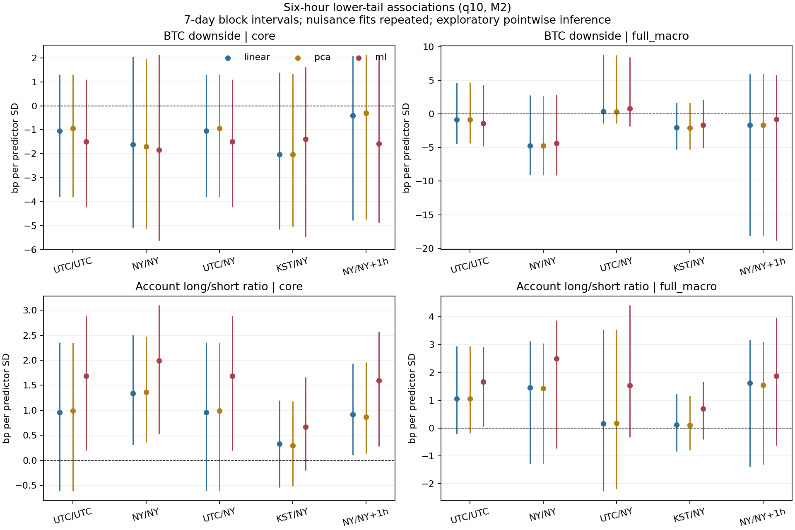

# 세 잔차의 동일 후속 실험 결과

2026-09-24. **선형·PCA·ML 잔차 모두에 동일한 후속 실험을 실행했다.** 공동 선형 회귀도 보조 대조로 포함했다. 실행 전 프로토콜·코드 커밋은 `f494a38`이다. 이전 분해 점수만 비교한 A1/A2와 구별한다.

**주요 결과:** 선형과 PCA 잔차는 거의 같았다. 6시간·하위 10%·M2의 BTC 하방위험 계수는 세 주 방법·다섯 시각 가정·두 통제 범위 모두에서 7일 블록 95% 구간이 0을 포함했다. 6~12시간 증폭과 포지셔닝의 추가 예측 가치도 조건에 걸쳐 일관되게 확인되지 않았다. 이는 효과가 없다는 확정이 아니라, 현재 자료·설계에서 강한 주장을 뒷받침할 근거가 부족하다는 결과다.

## 실행 범위

- 2025년 8월~2026년 3월의 원점에서 잔차를 과거 자료만으로 생성했다. 6~7월은 초기 학습·검증에 사용했다.
- 세 주 방법과 공동 OLS 대조에 같은 표본·변수·분위수 회귀를 적용했다. 하단/중앙/상단, 실제 1·6·12시간, 거시 통제 유무를 비교했다.
- 반응의 시간 변화는 1·6·12시간 정답이 모두 있는 **같은 원점**에서도 비교했다.
- 3일·7일 달력 블록 각각 199회, 다섯 시간대 가정에서 회귀·PCA·ML을 재적합했다. 설정 선택은 고정했다.
- 2026년 1~3월의 실제 6시간 뒤 잔차에 대해 선형 QR/분위수 LightGBM × 포지셔닝 제외/포함을 평가했다.
- 전·후반 기간 및 스트레스 상위 1일/5일 제외 결과도 저장했다. 이 제외 비교는 잔차와 이미 계산한 24시간 특징을 고정한 후속 회귀 민감도다. 사건 정보가 학습·다음 날 특징에서 완전히 제거된 분석은 아니다.

같은 자료·밀접한 공통 요인을 쓰므로 세 방법을 세 번의 독립 재현이라고 세지 않는다. 원고의 잘못된 환산과 행 시차를 그대로 반복하지 않았다.

## 1. 실제 비교 표본

| FX/미국 시각 가정 | 통제 범위 | 6시간 원점 수 | 1·6·12시간 공통 원점 수 |
|---|---|---|---|
| UTC/UTC | core | 1726 | 724 |
| UTC/UTC | full_macro | 238 | 0 |
| NY/NY | core | 1730 | 728 |
| NY/NY | full_macro | 238 | 0 |
| UTC/NY | core | 1726 | 724 |
| UTC/NY | full_macro | 188 | 188 |
| KST/NY | core | 1719 | 723 |
| KST/NY | full_macro | 1190 | 440 |
| NY/NY+1h | core | 1729 | 727 |
| NY/NY+1h | full_macro | 237 | 0 |

`core`는 BTC 상태·현재 잔차·계정 비율, `full_macro`는 여기에 FX·DXY·VIXY 수익률을 포함한 M2다. 시간대 사이 표본은 다르다. 공통 원점 0인 조건에서 거시 통제 후 지속성이 검증됐다고 주장하지 않는다.

### 잔차 자체의 비교

| 시각 가정 | 공통 원점 | 선형 SD(bp) | PCA SD(bp) | ML SD(bp) | 선형–PCA 상관 | 선형–ML 상관 |
|---|---|---|---|---|---|---|
| UTC/UTC | 2523 | 9.638 | 9.592 | 9.691 | 0.99998 | 0.98881 |
| NY/NY | 2527 | 9.622 | 9.575 | 9.543 | 0.99998 | 0.98795 |
| UTC/NY | 2523 | 9.638 | 9.592 | 9.691 | 0.99998 | 0.98881 |
| KST/NY | 2518 | 9.837 | 9.798 | 9.842 | 0.99999 | 0.99288 |
| NY/NY+1h | 2526 | 9.646 | 9.598 | 9.636 | 0.99998 | 0.98697 |

1시간 정답이 존재하는 동일한 원점의 잔차를 사용했다. 세 잔차는 많이 겹치며 특히 선형과 PCA는 거의 같다. 상관이 높아도 특정 하단 구간의 계수·예측 결과까지 같다는 뜻은 아니므로 아래 후속 실험을 별도로 수행했다.

## 2. 6시간 뒤 하단과의 조건부 관계

아래는 M2·q10의 설명변수 1표준편차당 **bp** 효과와 7일 블록 점별 95% 구간이다. 단순 부호와 구간을 구분한다. 199회 탐색 구간은 ML 설정 선택·다중 비교·사후 연구 설계를 모두 반영한 확증 추론이 아니다.

### BTC 하방위험

| 시각 가정 | 범위 | 선형 | PCA | ML |
|---|---|---|---|---|
| UTC/UTC | core | -1.04 [-3.79, +1.31] | -0.95 [-3.82, +1.30] | -1.49 [-4.23, +1.10] |
| UTC/UTC | full_macro | -0.85 [-4.42, +4.63] | -0.84 [-4.35, +4.68] | -1.43 [-4.79, +4.35] |
| NY/NY | core | -1.62 [-5.08, +2.05] | -1.70 [-5.12, +1.97] | -1.83 [-5.62, +2.14] |
| NY/NY | full_macro | -4.74 [-9.03, +2.76] | -4.71 [-9.11, +2.65] | -4.36 [-9.13, +2.85] |
| UTC/NY | core | -1.04 [-3.79, +1.31] | -0.95 [-3.82, +1.30] | -1.49 [-4.23, +1.10] |
| UTC/NY | full_macro | +0.36 [-1.42, +8.84] | +0.33 [-1.40, +8.74] | +0.82 [-1.85, +8.46] |
| KST/NY | core | -2.04 [-5.15, +1.38] | -2.03 [-5.03, +1.34] | -1.39 [-5.46, +1.62] |
| KST/NY | full_macro | -2.00 [-5.30, +1.68] | -2.08 [-5.29, +1.69] | -1.65 [-5.05, +2.10] |
| NY/NY+1h | core | -0.40 [-4.77, +2.09] | -0.30 [-4.74, +2.13] | -1.59 [-4.88, +2.07] |
| NY/NY+1h | full_macro | -1.68 [-18.08, +6.00] | -1.67 [-18.15, +6.00] | -0.82 [-18.84, +5.80] |

### 계정 롱/숏 비율

| 시각 가정 | 범위 | 선형 | PCA | ML |
|---|---|---|---|---|
| UTC/UTC | core | +0.96 [-0.61, +2.36] | +0.99 [-0.62, +2.35] | +1.68 [+0.19, +2.89] |
| UTC/UTC | full_macro | +1.05 [-0.22, +2.95] | +1.06 [-0.19, +2.95] | +1.66 [+0.05, +2.91] |
| NY/NY | core | +1.33 [+0.31, +2.50] | +1.36 [+0.36, +2.47] | +1.99 [+0.53, +3.10] |
| NY/NY | full_macro | +1.46 [-1.28, +3.13] | +1.42 [-1.29, +3.05] | +2.50 [-0.73, +3.88] |
| UTC/NY | core | +0.96 [-0.61, +2.36] | +0.99 [-0.62, +2.35] | +1.68 [+0.19, +2.89] |
| UTC/NY | full_macro | +0.16 [-2.28, +3.54] | +0.17 [-2.20, +3.54] | +1.53 [-0.33, +4.42] |
| KST/NY | core | +0.32 [-0.54, +1.20] | +0.30 [-0.51, +1.18] | +0.67 [-0.20, +1.66] |
| KST/NY | full_macro | +0.12 [-0.84, +1.23] | +0.10 [-0.80, +1.16] | +0.69 [-0.42, +1.67] |
| NY/NY+1h | core | +0.91 [+0.10, +1.93] | +0.87 [+0.14, +1.96] | +1.60 [+0.28, +2.57] |
| NY/NY+1h | full_macro | +1.62 [-1.39, +3.18] | +1.54 [-1.31, +3.11] | +1.88 [-0.64, +3.98] |

전체 분석기간의 6시간·M2에서 계정 롱/숏 점추정치는 세 주 방법 모두 양수다. 기존 원고의 음의 계수를 같은 방향으로 재현했다고 쓰지 않는다. 가격 환산, 실제 경과시간, 과거 적합과 분석기간도 달라졌으므로 기존 원고와의 차이 전체를 ML 도입 때문이라고 해석하지 않는다.

한 방법의 구간만 0을 제외한다고 두 방법의 차이가 입증되는 것은 아니다. 실제로 위 표의 전체 가용 원점 표본에서 기본 통제의 6시간·q10 계정 비율 계수를 비교하면 ML−선형의 짝지은 차이는 다섯 시각 가정 모두 7일 블록 95% 구간이 0을 포함했다.

선형과 PCA의 결과가 비슷한 것은 공통 요인이 강하게 겹치기 때문일 수 있다. 이번 월별 학습 표본에서 PC1의 설명 비중은 약 99.57~99.87%였다. 여기서 계정 비율은 레버리지 배수·금액 또는 한국 투자자 주문 흐름이 아니다.

## 3. 같은 원점에서의 지속·증폭 비교

아래는 `core`·M2·q10의 하방위험 효과 차이다. 음수는 1시간에 비해 더 음의 계수라는 뜻이며, 그 자체로 인과 충격반응이 아니다. [전체 직접 비교](results/paired_coefficient_contrasts.csv)에 거시 통제 조건·방법 간 차이·q10−q50 차이도 있다.

| 시각 가정 | 잔차 | 6h−1h | 12h−1h |
|---|---|---|---|
| UTC/UTC | 선형 | +3.00 [-0.82, +7.72] | +4.26 [+0.02, +8.77] |
| UTC/UTC | PCA | +2.75 [-0.83, +7.76] | +4.15 [+0.01, +8.78] |
| UTC/UTC | ML | +2.62 [-0.57, +7.20] | +3.70 [+0.34, +8.60] |
| NY/NY | 선형 | -1.82 [-4.88, +4.19] | +1.47 [-4.77, +6.53] |
| NY/NY | PCA | -1.80 [-4.77, +4.26] | +1.33 [-4.84, +6.42] |
| NY/NY | ML | -1.90 [-4.90, +4.85] | +1.04 [-4.86, +5.68] |
| UTC/NY | 선형 | +3.00 [-0.82, +7.72] | +4.26 [+0.02, +8.77] |
| UTC/NY | PCA | +2.75 [-0.83, +7.76] | +4.15 [+0.01, +8.78] |
| UTC/NY | ML | +2.62 [-0.57, +7.20] | +3.70 [+0.34, +8.60] |
| KST/NY | 선형 | -2.74 [-12.61, +0.43] | +0.89 [-2.96, +3.11] |
| KST/NY | PCA | -2.85 [-12.56, +0.54] | +0.75 [-2.77, +3.07] |
| KST/NY | ML | -1.84 [-12.24, +0.81] | -0.49 [-2.67, +3.27] |
| NY/NY+1h | 선형 | -0.36 [-1.97, +4.87] | +0.64 [-4.54, +5.36] |
| NY/NY+1h | PCA | +0.03 [-1.92, +4.53] | +0.64 [-4.68, +5.09] |
| NY/NY+1h | ML | +0.39 [-1.59, +4.84] | +1.58 [-4.45, +5.41] |

## 4. 미래 하단 예측의 추가 정보

예측 실험은 `core` 표본에서 수행했다. 정답은 **각 잔차 정의 안에서 고정**했다. 다른 잔차끼리 손실 절댓값을 비교한 AI 순위가 아니다. 평가 원점은 각 방법·예측 알고리즘에서 동일하며 시간대에 따라 576~577개다. 아래는 q10 pinball loss의 상대 변화율이다. 음수는 개선이다.

| 시각 가정 | 잔차 | QR: 포지셔닝 추가 | 예측 ML: 포지셔닝 추가 | 포지셔닝 포함: 예측 ML−QR |
|---|---|---|---|---|
| UTC/UTC | 선형 | +0.00% | +0.48% | +1.86% |
| UTC/UTC | PCA | +0.00% | +1.39% | +2.40% |
| UTC/UTC | ML | +0.03% | -0.52% | -5.00% |
| NY/NY | 선형 | -0.03% | -0.40% | +0.72% |
| NY/NY | PCA | +0.03% | -0.88% | +0.80% |
| NY/NY | ML | +0.16% | -1.53% | -5.01% |
| UTC/NY | 선형 | +0.00% | +0.48% | +1.86% |
| UTC/NY | PCA | +0.00% | +1.39% | +2.40% |
| UTC/NY | ML | +0.03% | -0.52% | -5.00% |
| KST/NY | 선형 | +0.31% | -1.75% | +6.64% |
| KST/NY | PCA | +0.13% | -0.52% | +6.85% |
| KST/NY | ML | +0.00% | +0.60% | +3.96% |
| NY/NY+1h | 선형 | +0.00% | +1.72% | +5.02% |
| NY/NY+1h | PCA | -0.00% | +1.82% | +4.77% |
| NY/NY+1h | ML | +0.31% | +0.87% | -0.83% |

예측 알고리즘의 ML과 잔차 생성 방식의 ML은 서로 다른 단계다. 포지셔닝 추가 가치가 모든 잔차·시각 조건에서 일관되게 개선된다고 결론낼 수 없다. 일부 조합에서 ML 예측이 개선돼도 미확정 시간대 중 유리한 것만 선택하지 않는다. 손실 차이의 3일·7일 블록 구간은 [예측 비교 CSV](results/forecast_comparisons.csv)에 기록했다. 이 구간은 저장된 예측에 조건부이고 예측모형을 재학습한 구간은 아니다.

## 5. 해석 범위

이번에 완료한 것은 **같은 후속 실험을 실제로 실행하고 방법 의존성을 비교한 것**이다. 세 방법의 기본 통제 하방 계수는 모두 음수지만, 거시 통제·시간대·부분기간까지 같은 경제적 결론이 성립하는지는 위 구간·민감도를 함께 봐야 한다. 기존 원고의 강한 레버리지 경로, 6~12시간 증폭, ML의 일관된 우위를 확보했다고 쓰지 않는다.

잔차는 한국 고유 수요나 자금 유출의 참값이 아니다. USDC/USD=1, 환율 시간대, 측정 공통성, 반복해서 본 역사자료와 제한된 사건 수라는 한계가 남는다. 정확한 시간·관측 가능한 통제 조건에서 재검토한 결과이며, 새로운 인과·구조적 메커니즘을 확정한 상태는 아니다.

## 재현 산출물

- [프로토콜](PROTOCOL_KO.md), `pipeline.py`, `forecast.py`, `run_followup.py`.
- `check_guards.py`: 과거 학습·PCA·불연속 시간·월 경계·미래 정답 가용성 검사.
- `verify_outputs.py`: A1/A2 잔차 재현, 동일 표본·정답, 720개 예측 설정 선택과 해시 검사.
- `results/coefficients.csv`, `coefficient_intervals.csv`, `paired_coefficient_contrasts.csv`: 점추정·생성 잔차 재적합 구간·직접 차이.
- `results/subperiod_and_stress.csv`: 전·후반 및 스트레스 날짜 제외 민감도.
- 시간대별 폴더: 관측별 잔차/정답, 검증 점수, 선택 설정, 예측값, 부트스트랩 반복값·실패 기록.
- `results/RUN_MANIFEST.json`: 입력·출력·코드 해시, 환경, 한계.

