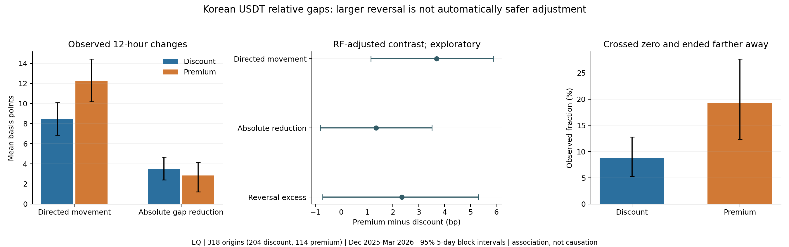

# 부호별 가격 조정과 과도 반전: 전체 결과

설계 `9288dfe`, 후속 해석 검증 `b11d137`. 같은 과거 자료의 탐색이며, 이번 결과를 확인한 뒤 추가한 검정은 아래에서 분리한다. 기존 예측성능 비교와 원고 재현은 변경하지 않았다.

## 1. 원래 고정한 주18개 검정

단위 bp. 조정 대비는 할증−할인의 부분선형 투영 계수다. 평균 행의 n은 전체 분석표본이고 group_n이 실제 해당 부호의 표본 수다. 개별95% 구간과 정의별 Holm6/전체 Holm18을 구분한다.

| definition | test | n | group_n | estimate | lo | hi | p_holm6 | p_holm18 |
|---|---|---|---|---|---|---|---|---|
| EQ | adjusted_premium_minus_discount_total | 318 |  | 3.6963 | 1.1469 | 5.8832 | 0.0140 | 0.0420 |
| EQ | adjusted_premium_minus_discount_dominance | 318 |  | -3.5998 | -29.7384 | 20.1825 | 1.0000 | 1.0000 |
| EQ | mean_discount_total | 318 | 204.0000 | 8.4352 | 6.8575 | 10.0882 | 0.0030 | 0.0090 |
| EQ | mean_premium_total | 318 | 114.0000 | 12.2168 | 10.1910 | 14.4247 | 0.0030 | 0.0090 |
| EQ | mean_discount_dominance | 318 | 204.0000 | -3.3707 | -20.0471 | 12.6250 | 1.0000 | 1.0000 |
| EQ | mean_premium_dominance | 318 | 114.0000 | 0.6242 | -14.2168 | 13.3431 | 1.0000 | 1.0000 |
| CAP | adjusted_premium_minus_discount_total | 275 |  | 2.6339 | 0.4442 | 4.6841 | 0.0700 | 0.1750 |
| CAP | adjusted_premium_minus_discount_dominance | 275 |  | -16.0960 | -47.9217 | 19.5265 | 1.0000 | 1.0000 |
| CAP | mean_discount_total | 275 | 184.0000 | 5.9115 | 4.7852 | 7.2209 | 0.0030 | 0.0090 |
| CAP | mean_premium_total | 275 | 91.0000 | 10.0749 | 8.4246 | 12.1869 | 0.0030 | 0.0090 |
| CAP | mean_discount_dominance | 275 | 184.0000 | 5.6760 | -9.5586 | 20.2130 | 1.0000 | 1.0000 |
| CAP | mean_premium_dominance | 275 | 91.0000 | 1.2448 | -14.3454 | 16.4274 | 1.0000 | 1.0000 |
| PCA | adjusted_premium_minus_discount_total | 317 |  | 3.6623 | 1.0864 | 5.8330 | 0.0140 | 0.0420 |
| PCA | adjusted_premium_minus_discount_dominance | 317 |  | -4.3652 | -30.5324 | 19.4945 | 1.0000 | 1.0000 |
| PCA | mean_discount_total | 317 | 203.0000 | 8.3736 | 6.7990 | 10.0195 | 0.0030 | 0.0090 |
| PCA | mean_premium_total | 317 | 114.0000 | 12.1203 | 10.1159 | 14.3128 | 0.0030 | 0.0090 |
| PCA | mean_discount_dominance | 317 | 203.0000 | -2.9546 | -19.3009 | 13.0002 | 1.0000 | 1.0000 |
| PCA | mean_premium_dominance | 317 | 114.0000 | 0.7210 | -14.1175 | 13.4172 | 1.0000 | 1.0000 |

## 2. 주 EQ 가격 구성요소

방향 이동의 양수는 처음 괴리를 닫는 방향이다. 이것만으로 절대 괴리 감소나 특정 가격이 조정을 주도했다고 해석하지 않는다. 다섯 회계적 가격 기여의 합이 total이다.

| outcome | group | group_n | estimate | lo | hi |
|---|---|---|---|---|---|
| local | discount | 204 | 2.5635 | -5.4740 | 10.1572 |
| local | premium | 114 | 6.4417 | -0.8977 | 12.8068 |
| basket_price | discount | 204 | 5.9342 | -2.5251 | 14.4373 |
| basket_price | premium | 114 | 5.8175 | -0.9112 | 13.4152 |
| basket_weights | discount | 204 | 0.0000 | 0.0000 | 0.0000 |
| basket_weights | premium | 114 | 0.0000 | 0.0000 | 0.0000 |
| numeraire | discount | 204 | -0.0784 | -0.1797 | 0.0284 |
| numeraire | premium | 114 | -0.0275 | -0.1767 | 0.1127 |
| global_control | discount | 204 | 0.0159 | -0.0437 | 0.0856 |
| global_control | premium | 114 | -0.0148 | -0.1123 | 0.0699 |
| total | discount | 204 | 8.4352 | 6.8575 | 10.0882 |
| total | premium | 114 | 12.2168 | 10.1910 | 14.4247 |
| dominance | discount | 204 | -3.3707 | -20.0471 | 12.6250 |
| dominance | premium | 114 | 0.6242 | -14.2168 | 13.3431 |

조건 통제 후 구성요소 차이(부호 대비):

| outcome | n | estimate | lo | hi |
|---|---|---|---|---|
| local | 318 | 0.0123 | -12.9019 | 11.6915 |
| basket_price | 318 | 3.6121 | -8.5322 | 16.5904 |
| basket_weights | 318 | 0.0000 | 0.0000 | 0.0000 |
| numeraire | 318 | 0.1117 | -0.1121 | 0.3121 |
| global_control | 318 | -0.0398 | -0.1677 | 0.0837 |
| total | 318 | 3.6963 | 1.1469 | 5.8832 |
| dominance | 318 | -3.5998 | -29.7384 | 20.1825 |

## 3. 절대 괴리와 부호 반전: 사전에 고정한 기술 통계

absolute_gap_reduction=처음 절대 괴리−12h 후 절대 괴리(bp); crossed_zero=반대편으로 넘어간 비율; overshot_farther=반대편으로 넘어가 처음보다 절대 괴리가 더 커진 비율. 비율의 단위는0~1이다.

| definition | group | n | quantity | estimate | lo | hi |
|---|---|---|---|---|---|---|
| CAP | discount | 184 | absolute_gap_reduction | 3.0817 | 2.4053 | 3.8826 |
| CAP | discount | 184 | crossed_zero | 0.2663 | 0.1962 | 0.3478 |
| CAP | discount | 184 | overshot_farther | 0.0652 | 0.0304 | 0.1027 |
| CAP | discount | 184 | local_return_bp | 5.8479 | -1.4944 | 13.3978 |
| CAP | discount | 184 | basket_implied_return_bp | -0.0940 | -8.2968 | 8.0131 |
| CAP | premium | 91 | absolute_gap_reduction | 2.9980 | 2.0722 | 3.8073 |
| CAP | premium | 91 | crossed_zero | 0.5165 | 0.4117 | 0.6622 |
| CAP | premium | 91 | overshot_farther | 0.1868 | 0.1212 | 0.2763 |
| CAP | premium | 91 | local_return_bp | -5.7190 | -13.1095 | 1.4913 |
| CAP | premium | 91 | basket_implied_return_bp | 4.4575 | -2.7824 | 12.0042 |
| EQ | discount | 204 | absolute_gap_reduction | 3.5101 | 2.3958 | 4.6576 |
| EQ | discount | 204 | crossed_zero | 0.3431 | 0.2660 | 0.4270 |
| EQ | discount | 204 | overshot_farther | 0.0882 | 0.0529 | 0.1281 |
| EQ | discount | 204 | local_return_bp | 2.6121 | -5.3240 | 10.1415 |
| EQ | discount | 204 | basket_implied_return_bp | -5.8821 | -14.4017 | 2.6502 |
| EQ | premium | 114 | absolute_gap_reduction | 2.8513 | 1.2131 | 4.1477 |
| EQ | premium | 114 | crossed_zero | 0.5526 | 0.4590 | 0.6512 |
| EQ | premium | 114 | overshot_farther | 0.1930 | 0.1238 | 0.2766 |
| EQ | premium | 114 | local_return_bp | -6.4350 | -12.7242 | 0.8816 |
| EQ | premium | 114 | basket_implied_return_bp | 5.8076 | -0.9397 | 13.4967 |
| PCA | discount | 203 | absolute_gap_reduction | 3.5018 | 2.3968 | 4.6398 |
| PCA | discount | 203 | crossed_zero | 0.3399 | 0.2627 | 0.4229 |
| PCA | discount | 203 | overshot_farther | 0.0936 | 0.0550 | 0.1372 |
| PCA | discount | 203 | local_return_bp | 2.7932 | -5.0744 | 10.4014 |
| PCA | discount | 203 | basket_implied_return_bp | -5.6366 | -14.1808 | 2.7541 |
| PCA | premium | 114 | absolute_gap_reduction | 2.8224 | 1.1950 | 4.1113 |
| PCA | premium | 114 | crossed_zero | 0.5439 | 0.4483 | 0.6496 |
| PCA | premium | 114 | overshot_farther | 0.1930 | 0.1238 | 0.2766 |
| PCA | premium | 114 | local_return_bp | -6.4350 | -12.7242 | 0.8816 |
| PCA | premium | 114 | basket_implied_return_bp | 5.7098 | -1.0262 | 13.4054 |

## 4. 주 결과를 본 뒤 추가한 조건 통제 검증

`directional movement = absolute gap reduction + reversal excess`. excess는 0을 통과한 후 이동을 두 번 센 차이이며, 모든 excess가 유해한 과도 반전인 것은 아니다. 기존 total과 m을 고정하고 새 absolute gap nuisance를 학습했다. theta_gap+theta_excess=기존 theta_total이 정확히 성립한다. cross/overshot 계수는0~1 단위라100배하면 %p다.

새4개(정의별)/12개(세 정의)/기존18개와 합친30개 Holm을 공개한다. 사후 탐색 전체를 보정하거나 독립 확증으로 바꾸는 절차는 아니다.

| definition | quantity | n | estimate | lo | hi | p_holm4 | p_holm12 | p_holm30 |
|---|---|---|---|---|---|---|---|---|
| CAP | gap | 275 | 1.6252 | 0.2740 | 2.9460 | 0.0450 | 0.1200 | 0.3000 |
| CAP | excess | 275 | 1.0087 | -1.3850 | 3.1628 | 0.3760 | 0.6870 | 1.0000 |
| CAP | cross | 275 | 0.3206 | 0.1461 | 0.4899 | 0.0060 | 0.0150 | 0.0330 |
| CAP | overshot | 275 | 0.1039 | 0.0212 | 0.1817 | 0.0450 | 0.1050 | 0.2550 |
| EQ | gap | 318 | 1.3487 | -0.8007 | 3.5134 | 0.2710 | 0.6870 | 1.0000 |
| EQ | excess | 318 | 2.3475 | -0.7172 | 5.3025 | 0.2710 | 0.6775 | 1.0000 |
| EQ | cross | 318 | 0.2960 | 0.1601 | 0.4362 | 0.0020 | 0.0060 | 0.0150 |
| EQ | overshot | 318 | 0.1054 | 0.0314 | 0.1740 | 0.0135 | 0.0405 | 0.0855 |
| PCA | gap | 317 | 1.3530 | -0.8153 | 3.6110 | 0.2830 | 0.6870 | 1.0000 |
| PCA | excess | 317 | 2.3092 | -0.7756 | 5.2834 | 0.2830 | 0.6775 | 1.0000 |
| PCA | cross | 317 | 0.2928 | 0.1568 | 0.4312 | 0.0020 | 0.0060 | 0.0150 |
| PCA | overshot | 317 | 0.1012 | 0.0252 | 0.1706 | 0.0210 | 0.0560 | 0.1260 |

## 5. 월·정의·설정 민감도

EQ 12h, 고정 RF40/첫 seed: 2월 제외,3월,10bp 조건까지 모두 공개한다. 아래 보조95% 구간은 다중비교 보정 구간이 아니다.

| sample | minimum_gap_bp | block_days | n | estimate | lo | hi | p |
|---|---|---|---|---|---|---|---|
| full | 5 | 1 | 318 | 3.6963 | 0.2970 | 7.1500 | 0.0340 |
| full | 5 | 5 | 318 | 3.6963 | 1.1469 | 5.8832 | 0.0035 |
| full | 5 | 10 | 318 | 3.6963 | 1.2693 | 5.8297 | 0.0025 |
| full | 0 | 5 | 509 | 3.9422 | 2.3087 | 5.5592 | 0.0005 |
| full | 10 | 5 | 177 | 2.1507 | -2.3033 | 6.2909 | 0.3075 |
| nonoverlap | 5 | 5 | 115 | 4.4594 | 0.6616 | 8.1096 | 0.0235 |
| overlap | 5 | 5 | 249 | 3.5624 | 1.0382 | 5.7842 | 0.0025 |
| 2025-12 | 5 | 5 | 84 | 1.7840 | -5.1562 | 7.8892 | 0.5705 |
| without_2025-12 | 5 | 5 | 234 | 4.2456 | 1.6351 | 6.4628 | 0.0035 |
| 2026-01 | 5 | 5 | 77 | 1.5300 | -3.7822 | 5.6854 | 0.5360 |
| without_2026-01 | 5 | 5 | 241 | 4.6173 | 1.7694 | 7.3052 | 0.0015 |
| 2026-02 | 5 | 5 | 80 | 6.4099 | 3.1736 | 10.3454 | 0.0040 |
| without_2026-02 | 5 | 5 | 238 | 2.9205 | -0.2992 | 5.5486 | 0.0495 |
| 2026-03 | 5 | 5 | 77 | 5.5295 | 0.0023 | 9.0244 | 0.0260 |
| without_2026-03 | 5 | 5 | 241 | 3.0648 | 0.0857 | 5.7611 | 0.0300 |
| common_path | 5 | 5 | 146 | 5.4376 | 1.0877 | 10.5131 | 0.0270 |

추가 검증의 같은 민감도:

| quantity | sample | minimum_gap_bp | n | estimate | lo | hi |
|---|---|---|---|---|---|---|
| gap | full | 5 | 318 | 1.3487 | -0.8007 | 3.5134 |
| excess | full | 5 | 318 | 2.3475 | -0.7172 | 5.3025 |
| cross | full | 5 | 318 | 0.2960 | 0.1601 | 0.4362 |
| overshot | full | 5 | 318 | 0.1054 | 0.0314 | 0.1740 |
| gap | full | 0 | 509 | 0.6926 | -0.6018 | 2.0789 |
| excess | full | 0 | 509 | 3.2496 | 1.4274 | 5.1291 |
| cross | full | 0 | 509 | 0.2243 | 0.1130 | 0.3322 |
| overshot | full | 0 | 509 | 0.1383 | 0.0634 | 0.2114 |
| gap | full | 10 | 177 | 1.6342 | -1.8960 | 5.2074 |
| excess | full | 10 | 177 | 0.5166 | -2.9081 | 4.3156 |
| cross | full | 10 | 177 | 0.3459 | 0.2044 | 0.5132 |
| overshot | full | 10 | 177 | 0.0887 | 0.0238 | 0.1644 |
| gap | nonoverlap | 5 | 115 | 0.9438 | -2.5498 | 4.7272 |
| excess | nonoverlap | 5 | 115 | 3.5156 | -0.2379 | 7.3957 |
| cross | nonoverlap | 5 | 115 | 0.2980 | 0.0732 | 0.5364 |
| overshot | nonoverlap | 5 | 115 | 0.1782 | 0.0637 | 0.3008 |
| gap | overlap | 5 | 249 | 1.1124 | -1.2199 | 3.4679 |
| excess | overlap | 5 | 249 | 2.4500 | -0.7155 | 5.5035 |
| cross | overlap | 5 | 249 | 0.2884 | 0.1585 | 0.4257 |
| overshot | overlap | 5 | 249 | 0.0996 | 0.0215 | 0.1712 |
| gap | 2025-12 | 5 | 84 | 6.5451 | 1.4841 | 11.9427 |
| excess | 2025-12 | 5 | 84 | -4.7612 | -10.0518 | 2.5098 |
| cross | 2025-12 | 5 | 84 | 0.2040 | -0.0565 | 0.5121 |
| overshot | 2025-12 | 5 | 84 | -0.0440 | -0.1805 | 0.0676 |
| gap | without_2025-12 | 5 | 234 | -0.1439 | -2.1508 | 2.0173 |
| excess | without_2025-12 | 5 | 234 | 4.3895 | 1.0515 | 7.3973 |
| cross | without_2025-12 | 5 | 234 | 0.3224 | 0.1623 | 0.4841 |
| overshot | without_2025-12 | 5 | 234 | 0.1483 | 0.0541 | 0.2267 |
| gap | 2026-01 | 5 | 77 | 2.1851 | -2.0267 | 6.0212 |
| excess | 2026-01 | 5 | 77 | -0.6551 | -6.9804 | 4.2849 |
| cross | 2026-01 | 5 | 77 | 0.2619 | -0.0772 | 0.5979 |
| overshot | 2026-01 | 5 | 77 | 0.0568 | -0.1357 | 0.1976 |
| gap | without_2026-01 | 5 | 241 | 0.9932 | -1.4024 | 3.6384 |
| excess | without_2026-01 | 5 | 241 | 3.6241 | 0.3546 | 7.1100 |
| cross | without_2026-01 | 5 | 241 | 0.3104 | 0.1728 | 0.4471 |
| overshot | without_2026-01 | 5 | 241 | 0.1261 | 0.0592 | 0.1924 |
| gap | 2026-02 | 5 | 80 | -2.8552 | -6.1044 | 0.4559 |
| excess | 2026-02 | 5 | 80 | 9.2651 | 4.6919 | 14.5009 |
| cross | 2026-02 | 5 | 80 | 0.2388 | -0.0191 | 0.5959 |
| overshot | 2026-02 | 5 | 80 | 0.1810 | 0.0377 | 0.3445 |
| gap | without_2026-02 | 5 | 238 | 2.5506 | 0.0396 | 4.9729 |
| excess | without_2026-02 | 5 | 238 | 0.3700 | -3.2091 | 3.7025 |
| cross | without_2026-02 | 5 | 238 | 0.3123 | 0.1538 | 0.4680 |
| overshot | without_2026-02 | 5 | 238 | 0.0838 | -0.0061 | 0.1589 |
| gap | 2026-03 | 5 | 77 | -0.5030 | -3.2587 | 1.9635 |
| excess | 2026-03 | 5 | 77 | 6.0326 | -0.5189 | 10.5538 |
| cross | 2026-03 | 5 | 77 | 0.4653 | 0.3162 | 0.5535 |
| overshot | 2026-03 | 5 | 77 | 0.2265 | 0.1502 | 0.2944 |
| gap | without_2026-03 | 5 | 241 | 1.9866 | -0.7835 | 4.6559 |
| excess | without_2026-03 | 5 | 241 | 1.0782 | -2.4637 | 4.5963 |
| cross | without_2026-03 | 5 | 241 | 0.2376 | 0.0595 | 0.4195 |
| overshot | without_2026-03 | 5 | 241 | 0.0637 | -0.0265 | 0.1525 |

같은 주 표본에서 RF20/RF40/seed/선형 비교:

| learner | seed | estimate | lo | hi |
|---|---|---|---|---|
| forest20 | 20260926 | 3.8095 | 1.1048 | 6.0943 |
| forest20 | 20260927 | 3.7448 | 1.0273 | 6.0998 |
| forest40 | 20260926 | 3.6963 | 1.1469 | 5.8832 |
| forest40 | 20260927 | 3.5093 | 0.8811 | 5.7732 |
| linear | 20260926 | 8.0558 | 3.9643 | 12.2391 |

| learner | seed | quantity | estimate | lo | hi |
|---|---|---|---|---|---|
| forest20 | 20260926 | gap | 1.5570 | -0.6813 | 3.9278 |
| forest20 | 20260926 | excess | 2.2524 | -0.8891 | 5.3448 |
| forest20 | 20260926 | cross | 0.2933 | 0.1572 | 0.4328 |
| forest20 | 20260926 | overshot | 0.1082 | 0.0305 | 0.1795 |
| forest20 | 20260927 | gap | 1.6447 | -0.6536 | 4.1050 |
| forest20 | 20260927 | excess | 2.1001 | -1.1787 | 5.2474 |
| forest20 | 20260927 | cross | 0.2894 | 0.1516 | 0.4322 |
| forest20 | 20260927 | overshot | 0.1072 | 0.0278 | 0.1789 |
| forest40 | 20260926 | gap | 1.3487 | -0.8007 | 3.5134 |
| forest40 | 20260926 | excess | 2.3475 | -0.7172 | 5.3025 |
| forest40 | 20260926 | cross | 0.2960 | 0.1601 | 0.4362 |
| forest40 | 20260926 | overshot | 0.1054 | 0.0314 | 0.1740 |
| forest40 | 20260927 | gap | 1.3579 | -0.8201 | 3.5860 |
| forest40 | 20260927 | excess | 2.1513 | -1.0300 | 5.1685 |
| forest40 | 20260927 | cross | 0.2893 | 0.1511 | 0.4304 |
| forest40 | 20260927 | overshot | 0.1030 | 0.0270 | 0.1714 |
| linear | 20260926 | gap | 3.9071 | -0.1694 | 8.9964 |
| linear | 20260926 | excess | 4.1487 | 1.1888 | 7.4387 |
| linear | 20260926 | cross | 0.2523 | 0.0916 | 0.4200 |
| linear | 20260926 | overshot | 0.0478 | -0.1006 | 0.1886 |

동일 출발점의1/6/12h(최소5bp) 경로:

| h | outcome | group | group_n | estimate | lo | hi |
|---|---|---|---|---|---|---|
| 1 | total | discount | 96 | 5.2970 | 3.4450 | 7.4828 |
| 1 | total | premium | 50 | 9.7797 | 7.2761 | 12.7816 |
| 1 | dominance | discount | 96 | -6.6096 | -11.5803 | -2.1806 |
| 1 | dominance | premium | 50 | -2.8941 | -8.9136 | 3.0409 |
| 6 | total | discount | 96 | 8.2352 | 6.5370 | 9.9791 |
| 6 | total | premium | 50 | 6.8723 | 4.5273 | 9.4907 |
| 6 | dominance | discount | 96 | 2.6948 | -8.3056 | 13.0481 |
| 6 | dominance | premium | 50 | -1.5496 | -12.3614 | 10.0951 |
| 12 | total | discount | 96 | 7.1549 | 5.1276 | 9.4135 |
| 12 | total | premium | 50 | 10.5436 | 7.1378 | 14.0521 |
| 12 | dominance | discount | 96 | 19.2250 | -5.2247 | 44.0575 |
| 12 | dominance | premium | 50 | -6.7460 | -29.6501 | 15.7882 |

## 6. 잔차 하락과 실제 국내 가격 하락은 다른 사건

509개 전체 평가 시점에서, 각 기준보다 잔차가 더 하락한 사건의 국내 USDT 가격 비하락 비중이다. 10bp가 고정 주 기준이며5/20bp도 공개한다. 비율의95% 구간은5일 블록이다. 국내 평균수익률의 양수만으로 통계적인 가격 상승을 주장하지 않는다.

| definition | residual_fall_bp | n | local_up_or_flat_n | local_up_or_flat_fraction | fraction_lo | fraction_hi |
|---|---|---|---|---|---|---|
| CAP | 5 | 143 | 85 | 0.5944 | 0.5200 | 0.6738 |
| CAP | 10 | 71 | 42 | 0.5915 | 0.4921 | 0.6834 |
| CAP | 20 | 12 | 10 | 0.8333 | 0.6667 | 1.0000 |
| EQ | 5 | 164 | 98 | 0.5976 | 0.5128 | 0.6880 |
| EQ | 10 | 104 | 57 | 0.5481 | 0.4634 | 0.6364 |
| EQ | 20 | 39 | 20 | 0.5128 | 0.4000 | 0.6429 |
| PCA | 5 | 161 | 96 | 0.5963 | 0.5123 | 0.6846 |
| PCA | 10 | 104 | 57 | 0.5481 | 0.4634 | 0.6364 |
| PCA | 20 | 37 | 19 | 0.5135 | 0.4048 | 0.6341 |

## 7. ML nuisance의 실제 품질

학습 이전 자료 평균/빈도와 비교한 미래 월 MSE/Brier다. ML이 선형보다 우월해야만 경제적 발견을 인정하는 것은 아니지만, ML이 더 정확하게 조건을 통제했다고 단정하지 않는다.

| definition | learner | seed | overlap_fraction | brier | constant_brier | mse_total | constant_mse_total | mse_dominance | constant_mse_dominance |
|---|---|---|---|---|---|---|---|---|---|
| CAP | forest20 | 20260926 | 0.7782 | 0.1208 | 0.2557 | 68.0648 | 71.1738 | 6648.2331 | 6409.1350 |
| CAP | forest20 | 20260927 | 0.7564 | 0.1204 | 0.2557 | 68.2695 | 71.1738 | 6566.5437 | 6409.1350 |
| CAP | forest40 | 20260926 | 0.8036 | 0.1233 | 0.2557 | 68.2703 | 71.1738 | 6520.5337 | 6409.1350 |
| CAP | forest40 | 20260927 | 0.7818 | 0.1222 | 0.2557 | 68.6436 | 71.1738 | 6505.9725 | 6409.1350 |
| CAP | linear | 20260926 | 0.7309 | 0.1221 | 0.2557 | 60.6651 | 71.1738 | 6750.9426 | 6409.1350 |
| EQ | forest20 | 20260926 | 0.7516 | 0.1415 | 0.2513 | 170.2536 | 177.0578 | 6767.6560 | 6673.0371 |
| EQ | forest20 | 20260927 | 0.7579 | 0.1419 | 0.2513 | 170.9011 | 177.0578 | 6769.0846 | 6673.0371 |
| EQ | forest40 | 20260926 | 0.7830 | 0.1442 | 0.2513 | 171.3739 | 177.0578 | 6718.7670 | 6673.0371 |
| EQ | forest40 | 20260927 | 0.7673 | 0.1431 | 0.2513 | 171.5281 | 177.0578 | 6737.1791 | 6673.0371 |
| EQ | linear | 20260926 | 0.6887 | 0.1280 | 0.2513 | 147.5891 | 177.0578 | 6869.6282 | 6673.0371 |
| PCA | forest20 | 20260926 | 0.7792 | 0.1416 | 0.2513 | 167.8800 | 174.7074 | 6786.7410 | 6671.8944 |
| PCA | forest20 | 20260927 | 0.7571 | 0.1415 | 0.2513 | 168.8793 | 174.7074 | 6786.6712 | 6671.8944 |
| PCA | forest40 | 20260926 | 0.7823 | 0.1434 | 0.2513 | 168.8614 | 174.7074 | 6723.0389 | 6671.8944 |
| PCA | forest40 | 20260927 | 0.7666 | 0.1445 | 0.2513 | 169.5163 | 174.7074 | 6729.8335 | 6671.8944 |
| PCA | linear | 20260926 | 0.6940 | 0.1281 | 0.2513 | 145.8129 | 174.7074 | 6891.5543 | 6671.8944 |

| definition | learner | seed | quantity | mse | constant_mse |
|---|---|---|---|---|---|
| CAP | forest20 | 20260926 | gap | 23.0912 | 41.0666 |
| CAP | forest20 | 20260926 | excess | 75.8951 | 64.5599 |
| CAP | forest20 | 20260926 | cross | 0.2352 | 0.2411 |
| CAP | forest20 | 20260926 | overshot | 0.0934 | 0.1137 |
| CAP | forest20 | 20260927 | gap | 23.1432 | 41.0666 |
| CAP | forest20 | 20260927 | excess | 76.5783 | 64.5599 |
| CAP | forest20 | 20260927 | cross | 0.2327 | 0.2411 |
| CAP | forest20 | 20260927 | overshot | 0.0933 | 0.1137 |
| CAP | forest40 | 20260926 | gap | 23.4609 | 41.0666 |
| CAP | forest40 | 20260926 | excess | 75.2466 | 64.5599 |
| CAP | forest40 | 20260926 | cross | 0.2338 | 0.2411 |
| CAP | forest40 | 20260926 | overshot | 0.0932 | 0.1137 |
| CAP | forest40 | 20260927 | gap | 23.4267 | 41.0666 |
| CAP | forest40 | 20260927 | excess | 75.9383 | 64.5599 |
| CAP | forest40 | 20260927 | cross | 0.2347 | 0.2411 |
| CAP | forest40 | 20260927 | overshot | 0.0933 | 0.1137 |
| CAP | linear | 20260926 | gap | 25.1223 | 41.0666 |
| CAP | linear | 20260926 | excess | 65.9013 | 64.5599 |
| CAP | linear | 20260926 | cross | 0.2446 | 0.2411 |
| CAP | linear | 20260926 | overshot | 0.1104 | 0.1137 |
| EQ | forest20 | 20260926 | gap | 79.4258 | 107.8232 |
| EQ | forest20 | 20260926 | excess | 144.7820 | 111.9398 |
| EQ | forest20 | 20260926 | cross | 0.2508 | 0.2459 |
| EQ | forest20 | 20260926 | overshot | 0.1078 | 0.1229 |
| EQ | forest20 | 20260927 | gap | 79.0367 | 107.8232 |
| EQ | forest20 | 20260927 | excess | 146.2220 | 111.9398 |
| EQ | forest20 | 20260927 | cross | 0.2512 | 0.2459 |
| EQ | forest20 | 20260927 | overshot | 0.1072 | 0.1229 |
| EQ | forest40 | 20260926 | gap | 80.7800 | 107.8232 |
| EQ | forest40 | 20260926 | excess | 140.7677 | 111.9398 |
| EQ | forest40 | 20260926 | cross | 0.2482 | 0.2459 |
| EQ | forest40 | 20260926 | overshot | 0.1075 | 0.1229 |
| EQ | forest40 | 20260927 | gap | 80.5730 | 107.8232 |
| EQ | forest40 | 20260927 | excess | 141.1167 | 111.9398 |
| EQ | forest40 | 20260927 | cross | 0.2485 | 0.2459 |
| EQ | forest40 | 20260927 | overshot | 0.1075 | 0.1229 |
| EQ | linear | 20260926 | gap | 78.8782 | 107.8232 |
| EQ | linear | 20260926 | excess | 115.3366 | 111.9398 |
| EQ | linear | 20260926 | cross | 0.2593 | 0.2459 |
| EQ | linear | 20260926 | overshot | 0.1908 | 0.1229 |
| PCA | forest20 | 20260926 | gap | 78.0597 | 106.6026 |
| PCA | forest20 | 20260926 | excess | 142.3221 | 110.7076 |
| PCA | forest20 | 20260926 | cross | 0.2498 | 0.2460 |
| PCA | forest20 | 20260926 | overshot | 0.1106 | 0.1249 |
| PCA | forest20 | 20260927 | gap | 77.9589 | 106.6026 |
| PCA | forest20 | 20260927 | excess | 144.1949 | 110.7076 |
| PCA | forest20 | 20260927 | cross | 0.2512 | 0.2460 |
| PCA | forest20 | 20260927 | overshot | 0.1103 | 0.1249 |
| PCA | forest40 | 20260926 | gap | 79.4546 | 106.6026 |
| PCA | forest40 | 20260926 | excess | 138.7573 | 110.7076 |
| PCA | forest40 | 20260926 | cross | 0.2484 | 0.2460 |
| PCA | forest40 | 20260926 | overshot | 0.1105 | 0.1249 |
| PCA | forest40 | 20260927 | gap | 79.2567 | 106.6026 |
| PCA | forest40 | 20260927 | excess | 139.6537 | 110.7076 |
| PCA | forest40 | 20260927 | cross | 0.2487 | 0.2460 |
| PCA | forest40 | 20260927 | overshot | 0.1100 | 0.1249 |
| PCA | linear | 20260926 | gap | 78.0818 | 106.6026 |
| PCA | linear | 20260926 | excess | 114.0393 | 110.7076 |
| PCA | linear | 20260926 | cross | 0.2583 | 0.2460 |
| PCA | linear | 20260926 | overshot | 0.1935 | 0.1249 |

## 8. 부호별 구조 차이 없이도 반전 비대칭이 생기는가

앞선 결과를 본 뒤 단순 대칭 평균회귀 대안 두 개를 고정해 반증 검사했다. affine은 절편과 공통 rho, local_center72는 과거72h 중심과 공통 rho다. 오차를 +/-로 복제하므로 충격 분포와 rho에 부호별 비대칭을 넣지 않는다. 아래 모멘트는 (사건-귀무모형 예측확률)의 오차가 현재 부호와 연결되는지를 검사한다. 새로운 DML 인과효과가 아니며 앞선29.6%p와 직접 빼서 설명 비중을 만들지 않는다. 비기각은 귀무모형의 참이나 두 모형의 동등성을 증명하지 않는다.

| definition | null | quantity | n | estimate | lo | hi | p_holm12 |
|---|---|---|---|---|---|---|---|
| CAP | affine | cross | 275 | 0.2577 | 0.0875 | 0.4198 | 0.0400 |
| CAP | affine | overshot | 275 | 0.0920 | 0.0114 | 0.1731 | 0.1925 |
| CAP | local_center72 | cross | 275 | 0.0922 | -0.0668 | 0.2363 | 0.7660 |
| CAP | local_center72 | overshot | 275 | 0.0337 | -0.0506 | 0.1132 | 0.7660 |
| EQ | affine | cross | 318 | 0.2605 | 0.1245 | 0.3931 | 0.0120 |
| EQ | affine | overshot | 318 | 0.1123 | 0.0328 | 0.1885 | 0.0405 |
| EQ | local_center72 | cross | 318 | 0.1412 | -0.0432 | 0.3146 | 0.7110 |
| EQ | local_center72 | overshot | 318 | 0.0616 | -0.0343 | 0.1480 | 0.7660 |
| PCA | affine | cross | 317 | 0.2565 | 0.1222 | 0.3889 | 0.0120 |
| PCA | affine | overshot | 317 | 0.1079 | 0.0277 | 0.1846 | 0.0520 |
| PCA | local_center72 | cross | 317 | 0.1380 | -0.0487 | 0.3134 | 0.7110 |
| PCA | local_center72 | overshot | 317 | 0.0575 | -0.0386 | 0.1451 | 0.7660 |

| definition | null | quantity | group | n | observed | expected | past_center_mean_bp |
|---|---|---|---|---|---|---|---|
| CAP | affine | cross | discount | 184 | 0.2663 | 0.3856 | -2.7272 |
| CAP | affine | cross | premium | 91 | 0.5165 | 0.4110 | -0.9409 |
| CAP | affine | overshot | discount | 184 | 0.0652 | 0.0880 | -2.7272 |
| CAP | affine | overshot | premium | 91 | 0.1868 | 0.1098 | -0.9409 |
| CAP | local_center72 | cross | discount | 184 | 0.2663 | 0.2936 | -2.7272 |
| CAP | local_center72 | cross | premium | 91 | 0.5165 | 0.4307 | -0.9409 |
| CAP | local_center72 | overshot | discount | 184 | 0.0652 | 0.0637 | -2.7272 |
| CAP | local_center72 | overshot | premium | 91 | 0.1868 | 0.1310 | -0.9409 |
| EQ | affine | cross | discount | 204 | 0.3431 | 0.4051 | -3.6403 |
| EQ | affine | cross | premium | 114 | 0.5526 | 0.4209 | -1.7508 |
| EQ | affine | overshot | discount | 204 | 0.0882 | 0.1207 | -3.6403 |
| EQ | affine | overshot | premium | 114 | 0.1930 | 0.1428 | -1.7508 |
| EQ | local_center72 | cross | discount | 204 | 0.3431 | 0.3327 | -3.6403 |
| EQ | local_center72 | cross | premium | 114 | 0.5526 | 0.4442 | -1.7508 |
| EQ | local_center72 | overshot | discount | 204 | 0.0882 | 0.1021 | -3.6403 |
| EQ | local_center72 | overshot | premium | 114 | 0.1930 | 0.1782 | -1.7508 |
| PCA | affine | cross | discount | 203 | 0.3399 | 0.4042 | -3.6352 |
| PCA | affine | cross | premium | 114 | 0.5439 | 0.4206 | -1.7497 |
| PCA | affine | overshot | discount | 203 | 0.0936 | 0.1193 | -3.6352 |
| PCA | affine | overshot | premium | 114 | 0.1930 | 0.1427 | -1.7497 |
| PCA | local_center72 | cross | discount | 203 | 0.3399 | 0.3318 | -3.6352 |
| PCA | local_center72 | cross | premium | 114 | 0.5439 | 0.4443 | -1.7497 |
| PCA | local_center72 | overshot | discount | 203 | 0.0936 | 0.1010 | -3.6352 |
| PCA | local_center72 | overshot | premium | 114 | 0.1930 | 0.1782 | -1.7497 |

| definition | null | quantity | brier | constant_brier |
|---|---|---|---|---|
| CAP | affine | cross | 0.2263 | 0.2411 |
| CAP | affine | overshot | 0.0919 | 0.1137 |
| CAP | local_center72 | cross | 0.2157 | 0.2411 |
| CAP | local_center72 | overshot | 0.0936 | 0.1137 |
| EQ | affine | cross | 0.2374 | 0.2459 |
| EQ | affine | overshot | 0.1035 | 0.1229 |
| EQ | local_center72 | cross | 0.2444 | 0.2459 |
| EQ | local_center72 | overshot | 0.1089 | 0.1229 |
| PCA | affine | cross | 0.2366 | 0.2460 |
| PCA | affine | overshot | 0.1057 | 0.1249 |
| PCA | local_center72 | cross | 0.2439 | 0.2460 |
| PCA | local_center72 | overshot | 0.1112 | 0.1249 |

## 9. 해석과 검증 기록

핵심 해석과 선행연구 대비 범위는 [CONCLUSION_KO.md](CONCLUSION_KO.md)를 참조한다. 모든 회귀 대비는 관측 조건부 연관성이다. 학습된 모형을 고정한 시계열 블록 구간이며, 전체 재탐색·잔차 추정·nuisance 재학습 불확실성을 모두 포함한 인과 신뢰구간이 아니다. CAP 가중치는 고정 공급량 대용이다. EQ/PCA가 매우 유사하므로 서로 독립된 시장의 반복 증거로 세지 않는다.

주 검증:6개 사전 테스트,3588개 원시 가격 경로 재계산,9건 재학습. 후속:3개 사전 테스트,모든 관측의 piecewise 항등식,기존 m/g_total 보존,9건 재학습. 후속 lock 생성에서 상대 소스 경로를 절대 경로로 바꾸는 기록 오류를 수정했다(`3704309`→`b11d137`); 후속 학습/결과 개봉 이전 수정이며 주 계산은 바뀌지 않았다.

추가로 대칭 모형의 반사 성질과 미래 표적 비사용 테스트2개, 모든 평가 시점72h 중심의 독립 시간 슬라이스 대조를 통과했다. 단순 대안 검사 설계는 `f0a35c2`로 고정했다.

전체 CSV, 예측, 원자료 연결, 실행 시각과 SHA256을 보관했다. [주 설계](PROTOCOL_KO.md) · [사후 해석 검증 설계](OVERSHOOT_PROTOCOL_KO.md) · [대칭 모형 검사](SYMMETRIC_NULL_PROTOCOL_KO.md) · [참고문헌과 읽은 범위](REFERENCES.md)

