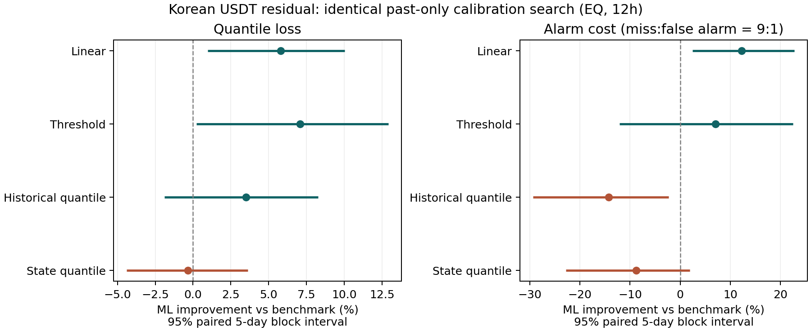

# 이번 최종 비교에서 무엇이 확인됐는가

**ML의 선형·문턱형 대비 평균 개선은 남았지만, 상태를 반영한 보정이 ML의 성능을 더 높이거나 3월 문제를 해소하지는 못했다. 강한 단순 상태별 기준선 대비 ML만의 추가 우위도 EQ 주 분석에서는 확인하지 못했다.** 모든 월에서 이겨야 한다는 기준으로 내린 결론은 아니다. 전체 평균, 비교군의 강도, 보정의 추가 효과를 구별한 결과다.

## 1. 공정하게 다시 비교한 ML의 성적

기존의 공통요인 분해, 12시간 하위 10% 잔차 예측, original/F 입력을 유지했다. 각 모형에 같은 7개 보정 후보를 주고 직전 3개월로 모형과 보정을 선택했다. 평가기간은 기존과 같은 2025년 12월~2026년 3월의 509시점이며, ML은 네 시드의 시점별 손실/결정 평균이다.

EQ 주 분석의 ML 개선율(양수면 ML 우세)은 다음과 같다.

| 동일하게 보정·선택한 비교군 | 예측손실 개선 | 10bp 추가 하락 경보 비용 개선 |
|---|---:|---:|
| 선형 분위수 | +5.81% | +12.24% |
| 문턱형 분위수 | +7.09% | +7.07% |
| 과거 변화의 경험분위수 + 상태 보정 | +3.52% | −14.22% |
| 상태별 경험분위수 + 보정 | −0.34% | −8.82% |

선형 대비 예측손실의 개별 5일 블록 95% 개선 구간은 [0.98, 10.03]%, 경보 비용은 [2.43, 22.84]%다. 다만 EQ의 8개 비교를 함께 고려한 Holm p값은 각각 .195, .175이며, 1일 블록 및 비중첩 표본에서도 불확실성이 커진다. 따라서 **평균 개선을 관찰했다**고 쓰고, 강하고 안정적인 통계적 우위를 확립했다고 쓰지 않는다.

강한 단순 상태별 기준선의 pinball은 1.8715bp, ML은 1.8779bp로 거의 같았다. 경보 비용은 각각 .05403, .05879였다. 기준선의 원시 모형은 단순하지만 이후 보정이 상태 정보를 사용하므로, 이를 완전히 무조건적인 예측기라고 부르면 안 된다.

CAP/PCA의 선형 대비 예측손실 개선은 +7.72%, +6.41%였다. CAP에서는 상태별 기준선 대비 pinball +4.99%가 정의별 8개 Holm p=.032인 긍정적 보조 결과도 있다. 그러나 같은 비교의 경보 비용은 −19.62%이고 전체 42개 Holm에서는 pinball p=.168이다. EQ를 CAP로 바꾸어 주 분석의 성공으로 보고하지 않는다.

## 2. 새 보정이 ML을 개선했는가

EQ에서 보정만 선택하고 기존 원시 ML 후보를 고정하면, 기존 ML 대비 손실은 **0.57% 증가**, 경보 비용은 **1.92% 증가**했다. 모형과 보정을 함께 선택하면 손실은 **0.85% 증가**, 비용은 **4.45% 증가**했다. 모두 개선/악화의 구간에 0이 포함된다. 이 결과는 새 보정의 추가 이점을 지지하지 않는다.

공동선택에서는 EQ의 기존 QRF 대신 분위수 부스팅이 선택됐다. 그 선택은 각 달 이전 자료의 점수에 따른 것이며 평가기간을 보고 바꾸지 않았다. 네 시드 모두 공동선택 ML의 전체 손실이 기존 ML보다 조금 높았다. 외부 성적이 좋은 고정 보정 규칙을 사후에 골라 대체하지 않았다.

**기준선이 강해진 영향이 크다.** 동일 절차에서 선형 자체의 기존 대비 pinball은 8.88% 감소했고, 단순 과거 경험분위수는 21.83% 감소했다. 후자의 경보 비용도 35.31% 감소했다. 이 수치는 각 기준선의 전후 점수에 대한 기술적 비교이며 별도로 사전 지정한 유의성 검정 결과는 아니다. ML의 기존 +14.89% 개선율을 새 +5.81%와 비교할 때, ML 자체가 크게 붕괴한 것으로 해석하면 틀린다. ML 손실은 1.8622→1.8779bp로 소폭 증가했고, 선형 손실이 2.1880→1.9937bp로 낮아졌다.

## 3. 경보와 상태별 보정은 같은 성과가 아니다

EQ 공동선택 ML은 공동선택 선형보다 오경보가 **224→159.75개** 줄었지만, 미탐은 **13→15.50개** 늘었다. 가정한 미탐:오경보 9:1에서는 비용이 감소했다. 이는 금전적 수익이 아니며 다른 비용 비율까지 같은 우위라고 할 수 없다.

ML 내부의 새 보정 전후를 비교하면 오경보는 178.50→159.75개 줄고 미탐은 12→15.50개 늘어, 같은 비용 비율의 전체 비용은 오히려 높아졌다. **오경보 감소만으로 개선이라고 판단하면 안 된다는 구체적 사례**다.

6개 상태의 평균 절대 보정오차는 3.65→2.69%p로 줄었지만, 높은 출발 잔차·높은 변동성 133시점의 경계 하회율은 **16.92→19.17%**로 목표 10%에서 더 멀어졌다. 낮거나 중간 잔차 상태의 개선이 평균을 낮춘 것이다. 전체 하회율도 10.22→12.18%로 높아졌다. 평균적인 조건 보정오차의 개선을 고위험 상태의 교정 성공으로 바꾸어 쓰지 않는다. 낮은 변동성 세 상태는 9~11시점으로 희소하다.

## 4. 3월은 해결됐는가

EQ 3월 105시점의 공동선택 ML은 같은 절차의 선형보다 손실이 **8.97% 컸다**. 기존 ML과 비교해도 손실 +2.70%, 경보 비용 +15.33%였다. 기존 원시 ML을 고정하고 보정만 선택했을 때의 손실 개선 +0.39% 역시 불확실했다. CAP/PCA 공동선택 ML의 3월 손실도 기존 ML보다 높았다.

따라서 **이번 국소·변동성 보정이 3월 악화를 해결했다**고 쓸 수 없다. 3월 하나 때문에 전체 평균 개선을 삭제하지도 않는다. 전체 기간에서 남는 장점과 3월의 약점을 함께 제시한다.

## 5. 논문에 남길 수 있는 결론

> 한국 USDT의 공통요인 조정 잔차에서 ML은 선형·문턱형 예측보다 평균적인 꼬리 예측손실과 일부 경보 비용을 낮췄다. 그러나 모형마다 동일한 상태 보정 기회를 주면 단순 경험분위수 기준선도 경쟁력을 보였다. 예측손실, 오경보 감소, 고위험 상태의 보정 정확성은 서로 다른 성과이며, 하나의 개선이 나머지를 보장하지 않았다.

기존에 확인한 실제 가격 구성요소 분석은 보존된다. 잔차 회복을 국내 USDT 가격 상승과 동일시하지 않는다는 해석도 유지한다. 이번 실험은 그 가격 경로 분석을 새 모형의 새 인과 근거로 바꾼 것이 아니다. 포지셔닝의 추가 기여도 이번에 새로 입증되지 않았다.

현재 근거는 **한국시장 잔차 위험에서 예측기와 보정 방법의 상대 기여 및 경보의 의미를 비교하는 연구**를 지지한다. 새로운 ML 알고리즘의 우월성이나 상태 보정으로 위험관리를 완성했다는 성능 논문은 지지하지 않는다. 이 차이를 명시해야 하며 워크숍 채택 가능성이 확인됐다는 뜻은 아니다.

## 6. 코드 오류와 실험 설계 점검

사전 테스트 7개, 222개 후보/시드 스트림의 독립 보정 재계산, 월별 선택의 독립 재계산, 9건 추가 학습 재현을 통과했다. 보정·상태 순위·재학습 예측의 최대 차이는 모두 0이었다. 경보 비용 독립 계산 오차는 1.39e−17, 손실 항등식 오차는 4.00e−15였다. 원시 예측이 같은 legacy 결과는 기존 보관본과 재현됐다. 실제 계산에 사용하지 않는 원본 `strategy` 설명 열의 빈값/문자 혼합 경고는 있었으며, 모형 구분에는 명시적인 `family`를 사용했다. 수치·시간·선택의 불일치나 성능 확인 후 수정은 없었다.

설계·코드 고정 커밋은 `81a8070`이며 새 결과를 열기 전에 원격에 저장했다. 예측 봉인→검증→성능 공개의 시각과 SHA-256을 보존했다. 이 절차는 이번 비교의 임의 변경을 막지만, 같은 과거 자료를 반복 사용한 연구 전체를 독립적인 새 자료 검증으로 바꾸지는 않는다.

[전체 수치표](RESULTS_KO.md) · [고정 설계](PROTOCOL_KO.md) · [주 비교 원자료](results/primary_tests.csv) · [월별 결과](results/monthly_metrics.csv)

