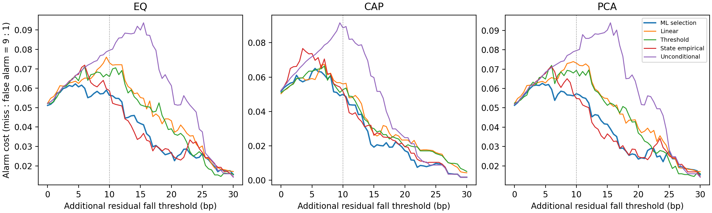
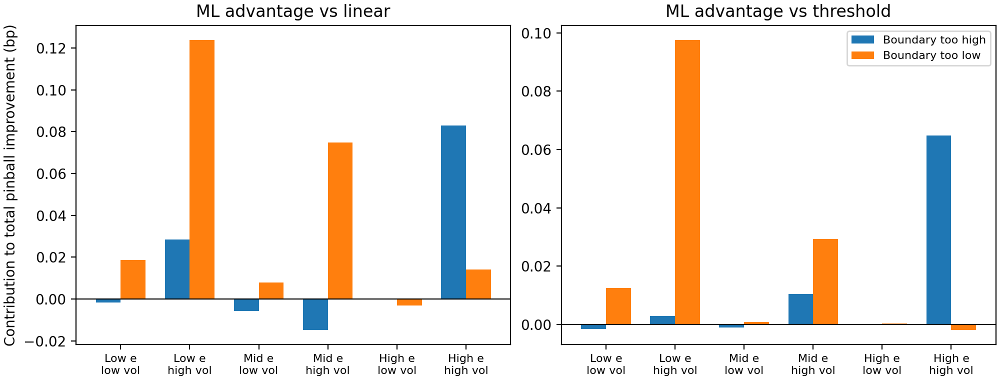

# 12시간 잔차 위험의 상태·경보·가격 경로 결과

[해석과 기여 판단](CONCLUSION_KO.md) · [실행 전 설계](PROTOCOL_KO.md) · [선행연구](REFERENCES_KO.md)

기존 자료를 재사용한 탐색적 분석이다. 아래 개선율은 미탐 비용을 오경보의9배로 둔 단위 없는 경보 비용의 감소다. 실제 투자손실이나 수익 개선율이 아니다. 주 문턱은 잔차의 실제12시간 **추가** 하락10bp다. 네 seed의 시점별 비용 평균을 사용하며509개 시점을2,036개로 세지 않는다.

## 주12개 비교

| definition | reference | n | reference_cost | ml_cost | improvement_pct | improvement_lo | improvement_hi | p_holm_12 |
| --- | --- | --- | --- | --- | --- | --- | --- | --- |
| EQ | linear | 509 | 0.0731 | 0.0563 | 22.9839 | 11.6020 | 33.3107 | 0.0060 |
| EQ | threshold | 509 | 0.0660 | 0.0563 | 14.7321 | -1.1715 | 28.4100 | 0.3675 |
| EQ | historical | 509 | 0.0796 | 0.0563 | 29.2593 | 12.9355 | 43.6726 | 0.0090 |
| EQ | state_hist | 509 | 0.0587 | 0.0563 | 4.1806 | -11.1239 | 17.1370 | 1.0000 |
| CAP | linear | 509 | 0.0560 | 0.0500 | 10.7018 | 0.4941 | 20.6527 | 0.3675 |
| CAP | threshold | 509 | 0.0527 | 0.0500 | 5.0373 | -5.3253 | 14.0254 | 1.0000 |
| CAP | historical | 509 | 0.0886 | 0.0500 | 43.5698 | 33.3782 | 54.5575 | 0.0060 |
| CAP | state_hist | 509 | 0.0517 | 0.0500 | 3.2319 | -10.1545 | 14.7777 | 1.0000 |
| PCA | linear | 509 | 0.0731 | 0.0573 | 21.6398 | 10.3054 | 32.0406 | 0.0060 |
| PCA | threshold | 509 | 0.0694 | 0.0573 | 17.4221 | -0.6525 | 31.9436 | 0.3675 |
| PCA | historical | 509 | 0.0796 | 0.0573 | 28.0247 | 12.3841 | 42.3382 | 0.0090 |
| PCA | state_hist | 509 | 0.0548 | 0.0573 | -4.4803 | -26.8904 | 10.9234 | 1.0000 |

## 경보 부담과 미탐

| definition | strategy | n | events | alarms | false_positives | false_negatives | recall | precision | cost |
| --- | --- | --- | --- | --- | --- | --- | --- | --- | --- |
| EQ | ml_selected | 509 | 104.0000 | 270.5000 | 178.5000 | 12.0000 | 0.8846 | 0.3401 | 0.0563 |
| EQ | linear | 509 | 104.0000 | 386.0000 | 291.0000 | 9.0000 | 0.9135 | 0.2461 | 0.0731 |
| EQ | threshold | 509 | 104.0000 | 330.0000 | 237.0000 | 11.0000 | 0.8942 | 0.2818 | 0.0660 |
| EQ | historical | 509 | 104.0000 | 509.0000 | 405.0000 | 0.0000 | 1.0000 | 0.2043 | 0.0796 |
| EQ | state_hist | 509 | 104.0000 | 293.0000 | 200.0000 | 11.0000 | 0.8942 | 0.3174 | 0.0587 |
| EQ | always_alarm | 509 | 104.0000 | 509.0000 | 405.0000 | 0.0000 | 1.0000 | 0.2043 | 0.0796 |
| EQ | never_alarm | 509 | 104.0000 | 0.0000 | 0.0000 | 104.0000 | 0.0000 | nan | 0.1839 |
| CAP | ml_selected | 509 | 71.0000 | 225.5000 | 164.5000 | 10.0000 | 0.8592 | 0.2705 | 0.0500 |
| CAP | linear | 509 | 71.0000 | 246.0000 | 186.0000 | 11.0000 | 0.8451 | 0.2439 | 0.0560 |
| CAP | threshold | 509 | 71.0000 | 229.0000 | 169.0000 | 11.0000 | 0.8451 | 0.2620 | 0.0527 |
| CAP | historical | 509 | 71.0000 | 402.0000 | 343.0000 | 12.0000 | 0.8310 | 0.1468 | 0.0886 |
| CAP | state_hist | 509 | 71.0000 | 234.0000 | 173.0000 | 10.0000 | 0.8592 | 0.2607 | 0.0517 |
| CAP | always_alarm | 509 | 71.0000 | 509.0000 | 438.0000 | 0.0000 | 1.0000 | 0.1395 | 0.0861 |
| CAP | never_alarm | 509 | 71.0000 | 0.0000 | 0.0000 | 71.0000 | 0.0000 | nan | 0.1255 |
| PCA | ml_selected | 509 | 104.0000 | 270.5000 | 179.0000 | 12.5000 | 0.8798 | 0.3383 | 0.0573 |
| PCA | linear | 509 | 104.0000 | 386.0000 | 291.0000 | 9.0000 | 0.9135 | 0.2461 | 0.0731 |
| PCA | threshold | 509 | 104.0000 | 327.0000 | 236.0000 | 13.0000 | 0.8750 | 0.2783 | 0.0694 |
| PCA | historical | 509 | 104.0000 | 509.0000 | 405.0000 | 0.0000 | 1.0000 | 0.2043 | 0.0796 |
| PCA | state_hist | 509 | 104.0000 | 273.0000 | 180.0000 | 11.0000 | 0.8942 | 0.3407 | 0.0548 |
| PCA | always_alarm | 509 | 104.0000 | 509.0000 | 405.0000 | 0.0000 | 1.0000 | 0.2043 | 0.0796 |
| PCA | never_alarm | 509 | 104.0000 | 0.0000 | 0.0000 | 104.0000 | 0.0000 | nan | 0.1839 |

ML 빈도는 seed 평균이므로 소수가 될 수 있다. 실제 한 실행의 빈도·민감도는 [seed 표](results/seed_sensitivity.csv)에 있다.

## 정보 추가의 경보 가치

| definition | comparison | improvement_pct | improvement_lo | improvement_hi |
| --- | --- | --- | --- | --- |
| EQ | B_vs_R | -0.3260 | -6.0650 | 4.0209 |
| EQ | F_vs_B | 6.9050 | 0.5726 | 13.9140 |
| EQ | F_vs_R | 6.6015 | 1.4644 | 12.0284 |
| CAP | B_vs_R | -0.8264 | -13.3737 | 10.1853 |
| CAP | F_vs_B | -4.3033 | -12.1773 | 0.3886 |
| CAP | F_vs_R | -5.1653 | -19.4742 | 7.1993 |
| PCA | B_vs_R | -6.9054 | -17.9077 | 2.1320 |
| PCA | F_vs_B | 7.0175 | -0.4325 | 15.0085 |
| PCA | F_vs_R | 0.5968 | -4.1633 | 4.8544 |

## 주 EQ 상태별 손실 개선의 기여

| reference | state | n | share | difference_bp | difference_lo | difference_hi | contribution_bp | too_high_contribution_bp | too_low_contribution_bp |
| --- | --- | --- | --- | --- | --- | --- | --- | --- | --- |
| linear | 0 | 11 | 0.0216 | 0.7911 | 0.3888 | 0.9203 | 0.0171 | -0.0016 | 0.0187 |
| linear | 1 | 248 | 0.4872 | 0.3127 | 0.0947 | 0.5675 | 0.1524 | 0.0285 | 0.1238 |
| linear | 2 | 10 | 0.0196 | 0.1119 | -0.4304 | 0.5680 | 0.0022 | -0.0056 | 0.0078 |
| linear | 3 | 98 | 0.1925 | 0.3119 | 0.1026 | 0.5113 | 0.0601 | -0.0148 | 0.0749 |
| linear | 4 | 9 | 0.0177 | -0.1756 | -0.2705 | -0.0520 | -0.0031 | 0.0000 | -0.0031 |
| linear | 5 | 133 | 0.2613 | 0.3720 | 0.1252 | 0.6896 | 0.0972 | 0.0830 | 0.0142 |
| threshold | 0 | 11 | 0.0216 | 0.4992 | 0.1625 | 0.6254 | 0.0108 | -0.0016 | 0.0124 |
| threshold | 1 | 248 | 0.4872 | 0.2060 | 0.0813 | 0.3308 | 0.1004 | 0.0028 | 0.0976 |
| threshold | 2 | 10 | 0.0196 | -0.0187 | -0.2452 | 0.2545 | -0.0004 | -0.0012 | 0.0008 |
| threshold | 3 | 98 | 0.1925 | 0.2066 | 0.0705 | 0.3470 | 0.0398 | 0.0105 | 0.0293 |
| threshold | 4 | 9 | 0.0177 | 0.0176 | -0.2675 | 0.4592 | 0.0003 | 0.0000 | 0.0003 |
| threshold | 5 | 133 | 0.2613 | 0.2404 | -0.0428 | 0.6069 | 0.0628 | 0.0647 | -0.0019 |

상태0/1은 학습 잔차 하위1/3,2/3은 중간,4/5는 상위1/3이며 짝수/홀수는 학습 RMS 중앙값 미만/이상이다. contribution은 전체 표본 비중을 반영해 가산되며, 특정 상태만 선택한 새 성과가 아니다.

## 실제 가격 경로: 주 EQ, 선형과 다른 경보

| group | outcome | n | days | status | mean | ci_low | ci_high |
| --- | --- | --- | --- | --- | --- | --- | --- |
| both | delta_e | 260 | 69 | adequate | -5.8865 | -6.9983 | -4.8532 |
| both | local_logreturn_bp | 260 | 69 | adequate | -2.5776 | -8.2455 | 3.3307 |
| both | delta_local_bp | 260 | 69 | adequate | -2.6184 | -8.2839 | 3.2979 |
| both | delta_fx_bp | 260 | 69 | adequate | -1.0326 | -7.1342 | 5.9684 |
| both | delta_market_bp | 260 | 69 | adequate | -2.1957 | -8.0484 | 3.2702 |
| both | fall10 | 260 | 69 | adequate | 0.3462 | 0.2960 | 0.3979 |
| ml_only | delta_e | 9 | 5 | limited | 3.2309 | -5.5243 | 13.7936 |
| ml_only | local_logreturn_bp | 9 | 5 | limited | -6.6971 | -33.9196 | 12.8443 |
| ml_only | delta_local_bp | 9 | 5 | limited | -6.7565 | -33.8962 | 12.7812 |
| ml_only | delta_fx_bp | 9 | 5 | limited | 32.1979 | 9.5225 | 67.4613 |
| ml_only | delta_market_bp | 9 | 5 | limited | -21.6722 | -46.2453 | 1.3051 |
| ml_only | fall10 | 9 | 5 | limited | 0.2222 | 0.0000 | 0.5455 |
| reference_only | delta_e | 126 | 47 | adequate | 6.2550 | 3.8869 | 9.0607 |
| reference_only | local_logreturn_bp | 126 | 47 | adequate | -4.6035 | -13.2805 | 2.6826 |
| reference_only | delta_local_bp | 126 | 47 | adequate | -4.6752 | -13.4880 | 2.7130 |
| reference_only | delta_fx_bp | 126 | 47 | adequate | -0.9146 | -9.6902 | 8.8297 |
| reference_only | delta_market_bp | 126 | 47 | adequate | 11.9343 | 4.2934 | 19.8954 |
| reference_only | fall10 | 126 | 47 | adequate | 0.0397 | 0.0081 | 0.0714 |
| neither | delta_e | 114 | 46 | adequate | 7.9071 | 5.9048 | 10.4518 |
| neither | local_logreturn_bp | 114 | 46 | adequate | 11.4471 | -0.0586 | 22.5878 |
| neither | delta_local_bp | 114 | 46 | adequate | 11.4831 | -0.1706 | 22.8182 |
| neither | delta_fx_bp | 114 | 46 | adequate | -4.8638 | -16.8625 | 9.4245 |
| neither | delta_market_bp | 114 | 46 | adequate | 1.4254 | -9.8722 | 13.0824 |
| neither | fall10 | 114 | 46 | adequate | 0.0614 | 0.0165 | 0.1131 |

경로 집단은 첫 seed의 고정 경보다. 아래 집단 간 차이는 인과효과가 아니다.

| definition | reference | outcome | ml_only_n | reference_only_n | difference | ci_low | ci_high | bootstrap_valid_fraction |
| --- | --- | --- | --- | --- | --- | --- | --- | --- |
| EQ | linear | delta_e | 9 | 126 | -3.0241 | -12.9314 | 7.2703 | 0.9995 |
| EQ | linear | local_logreturn_bp | 9 | 126 | -2.0936 | -29.8885 | 20.1443 | 0.9995 |
| EQ | linear | fall10 | 9 | 126 | 0.1825 | -0.0612 | 0.5140 | 0.9995 |
| EQ | threshold | delta_e | 24 | 85 | -4.3509 | -8.9806 | 0.6214 | 1.0000 |
| EQ | threshold | local_logreturn_bp | 24 | 85 | 2.2162 | -11.6871 | 15.4170 | 1.0000 |
| EQ | threshold | fall10 | 24 | 85 | 0.0779 | -0.0426 | 0.1900 | 1.0000 |
| CAP | linear | delta_e | 14 | 34 | -6.6613 | -11.9127 | -2.2870 | 1.0000 |
| CAP | linear | local_logreturn_bp | 14 | 34 | 11.2911 | -6.5397 | 30.5118 | 1.0000 |
| CAP | linear | fall10 | 14 | 34 | 0.1134 | -0.0455 | 0.3237 | 1.0000 |
| CAP | threshold | delta_e | 21 | 24 | -2.9609 | -6.5076 | 0.9208 | 1.0000 |
| CAP | threshold | local_logreturn_bp | 21 | 24 | 9.0367 | -9.5768 | 28.8683 | 1.0000 |
| CAP | threshold | fall10 | 21 | 24 | 0.0536 | -0.0653 | 0.1865 | 1.0000 |
| PCA | linear | delta_e | 12 | 124 | -1.8982 | -10.7374 | 5.6567 | 0.9995 |
| PCA | linear | local_logreturn_bp | 12 | 124 | 4.2499 | -19.5331 | 31.0047 | 0.9995 |
| PCA | linear | fall10 | 12 | 124 | 0.1183 | -0.0699 | 0.4129 | 0.9995 |
| PCA | threshold | delta_e | 30 | 83 | -4.8223 | -9.7982 | 0.1979 | 1.0000 |
| PCA | threshold | local_logreturn_bp | 30 | 83 | 10.0330 | -3.3698 | 25.2859 | 1.0000 |
| PCA | threshold | fall10 | 30 | 83 | 0.1064 | -0.0307 | 0.2501 | 1.0000 |

## 동일 시작점 자료 가용성

| definition | origin_n | h1_n | h6_n | h12_n | common_n |
| --- | --- | --- | --- | --- | --- |
| EQ | 509 | 448 | 239 | 509 | 239 |
| CAP | 509 | 448 | 239 | 509 | 239 |
| PCA | 509 | 448 | 239 | 509 | 239 |

## 전체 결과 파일

- [월별 비용·경보](results/monthly_metrics.csv), [모든 문턱/보정/중첩 제거 비교](results/comparisons.csv), [state 지표](results/state_metrics.csv)
- [Murphy 문턱별 비용](results/murphy_curve.csv), [seed 민감도](results/seed_sensitivity.csv), [경로 seed 민감도](results/path_seed_sensitivity.csv)
- [가격 구성요소 전체 표](results/path_summary.csv), [구현 검증](results/VERIFICATION.json), [현재 잔차 연결 검증](results/ALIGNMENT_VERIFIED.json)

