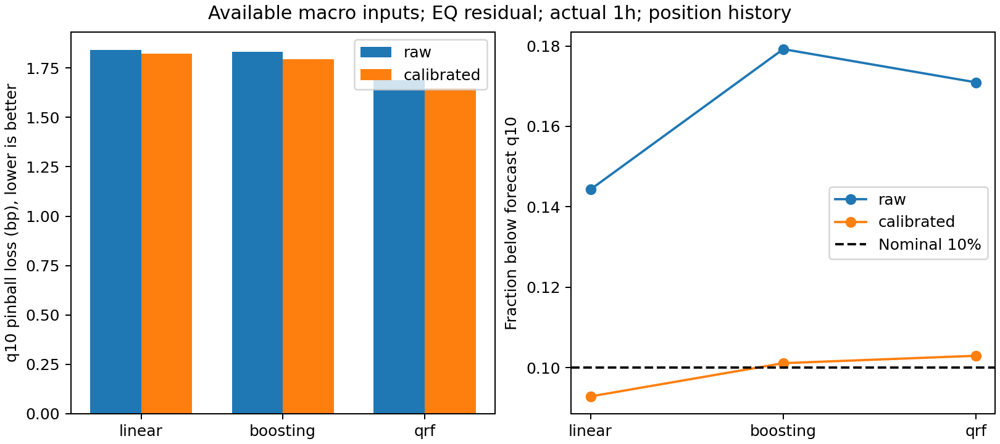

# 후속 결과: ML 예측 개선은 확인, 포지셔닝 기여는 작고 조건부

2026-09-25. 첫 부스팅 결과만으로 ML을 배제할 근거는 없었다. 학습 표현·분포 변화·정보 가용성을 점검하고 **Quantile Regression Forest(QRF)**를 추가한 결과, 주 분석에서 동일 조건의 선형 대비 예측손실이 **9.63% 감소**했다. 포지셔닝 수준과 최근 변화량을 함께 추가한 효과는 **1.32%**였지만, 이 효과는 보정 여부·잔차 정의·난수에 민감했다.

이 결과는 원고 이후의 연구를 계속할 구체적 근거다. 다만 **“레버리지 쏠림이 한국 USDT의 하락을 일으킨다”거나 새로운 경제적 기여를 완성했다고 결론내린 결과는 아니다.** 최초 결과를 확인한 기간을 재사용한 탐색적 후속이며, 독립된 새 기간의 검증이 아니다.

## 무엇을 실제로 바꿨는가

원고의 공통 시장 프리미엄·글로벌 괴리 순차 회귀 잔차를 유지했다. ML은 그 뒤의 **1시간 후 잔차 하위 10% 경계 예측**에 들어간다.

1. 과거 전체와 최근 90일 학습을 비교했다. 잔차 수준을 직접 학습하거나, 변화량을 학습한 뒤 현재 잔차를 더하는 표현을 내부 검증으로 선택했다. 선형에도 같은 선택권을 주었다.
2. 기존 계정 롱숏·펀딩·OI 수준 외에 계정 롱숏의 1h/24h 변화, 펀딩 8h 변화, OI 24h 변화를 추가했다.
3. 부스팅과 함께 QRF를 실행했다. 같은 나뭇잎에 도달한 과거 관측의 가중 분포에서 분위수를 구하는 방법이다. 트리 평균 예측들의 분위수가 아니다.
4. 선형·ML 모두 이미 결과를 아는 최근 예측오차만으로 경계를 보정했다. 보정 전후를 전부 보고했다.
5. 예측 입력 VIX/DXY의 마지막 알려진 값과 관측 경과시간을 사용했다. **환율·코인 가격·미래 목표·잔차는 보간하지 않았다.** 같은 시점의 잔차는 기존 실험과 동일하다.

평가 기간은 2025-12-01~2026-03-19다. 기존 표본은 **467개 시점/77일**, 확장 표본은 **1,088개 시점/78일**이다. 하루 안에서 이용할 수 있는 시점이 늘어난 것으로, 관측 기간이나 독립 시장 이력이 두 배 늘어난 것은 아니다. 여전히 유효 환율 관측 세션에 조건부인 연구이며 24/7 전체 시장 검증이 아니다.

각 월의 후보 선택은 직전 달 검증에서 했다. EQ/CAP/PCA × 두 표본 × 세 정보 조건 × 선형/부스팅/QRF, 보정 준비 월을 포함해 최종 학습 270회와 내부 후보 학습 3,240회를 실행했다. **총 3,510회는 모델 종류나 독립 표본 수가 아니다.** 모델별 평가 예측 41,985개를 저장했다. [설계](PROTOCOL_KO.md), [실행 기록](results/execution.log).

## 주 결과: 같은 조건의 선형과 ML 비교

확장 표본·EQ 잔차·1h·포지셔닝 수준과 변화량 포함. 모든 모델의 입력·평가 시점·보정 규칙이 같다. 손실은 작을수록 좋으며 투자 수익률이나 가격 변화가 아닌 **분위수 예측 점수(bp)**다.

| 모델 | 보정 전 손실 | 보정 후 손실 | 보정 후 경계 하회율 | 선형 대비 보정 후 개선 |
|---|---:|---:|---:|---:|
| 적응형 선형 분위수 회귀 | 1.8413 | 1.8232 | 9.28% | 기준 |
| 분위수 부스팅 | 1.8329 | 1.7933 | 10.11% | 1.64% |
| QRF | 1.6897 | 1.6477 | 10.29% | **9.63%** |

QRF의 선형 대비 개선은 5일 달력 블록 구간 **6.79~12.52%**, 후속 주 비교 6개의 탐색적 Holm p=0.003이다. 1일·10일 블록에서도 개선 방향이 유지됐다. 부스팅 개선 구간은 -1.73~4.93%로 0을 포함한다.

보정 전에도 QRF는 선형 대비 **8.23%** 개선됐고 구간은 4.83~11.15%였다. 따라서 전체 이득을 과거 오차 보정 하나로 설명할 수 없다. 다만 원예측의 하회율은 QRF 17.10%, 선형 14.43%로 둘 다 목표 10%를 초과한다. 손실 우위와 위험 경계의 보정은 서로 다른 평가다. 보정 후 QRF의 하회율 구간은 8.93~11.72%이며, 이것이 모든 시장 상태에서 정확한 조건부 보정을 보장하지 않는다.

| 평가 월 | 선형 손실 | QRF 손실 |
|---|---:|---:|
| 2025-12 | 1.8803 | 1.6272 |
| 2026-01 | 1.6301 | 1.3873 |
| 2026-02 | 1.8903 | 1.8023 |
| 2026-03 (19일까지) | 1.9236 | 1.8451 |

네 평가 월 모두 QRF가 개선됐다. [전체 표](results/AUTOMATED_RESULTS_KO.md), [월별 표](results/monthly_metrics.csv), [대응 비교](results/comparisons.csv).

## 포지셔닝 정보는 얼마나 기여했는가

QRF의 `base`는 잔차·시장·거시·국내 거래활동만, `full`은 기존 포지셔닝 수준 포함, `history`는 그 최근 변화량까지 포함한다.

| 보정 후 비교 | 손실 개선 | 5일 블록 구간 | 개선 월 | 탐색 Holm p |
|---|---:|---:|---:|---:|
| history 대 base | **1.32%** | 0.31~2.43% | 3/4 | 0.0375 |
| history 대 full | **2.29%** | 1.10~3.50% | 4/4 | 0.0030 |

포지셔닝 수준만 추가한 QRF는 base보다 오히려 나빴다(손실 1.6864 대 1.6697). 최근 변화량까지 넣은 history의 손실이 1.6477이었다. **“포지셔닝 변수를 넣기만 하면 좋아진다”는 결과가 아니다.**

또한 보정 전 history 대 base 개선은 **0.10%, 구간 -1.07~1.34%**로 뚜렷하지 않았다. 따라서 포지셔닝 전체의 증분 정보는 현재 **보정된 예측 절차에서 관찰된 작고 조건부인 신호**로 표현해야 한다. QRF의 선형 대비 9.63%를 전부 포지셔닝 효과라고 부르면 잘못이다.

과거 학습의 75% 경계로 나눈 설명적 상태 비교에서도 단순한 레버리지 이야기가 나오지 않는다. history 대 base의 보정 후 개선은 고하방·낮은 계정 롱숏에서 4.06%(215개), 고하방·높은 계정 롱숏에서는 0.10%(297개)였다. 이 분할은 시작 잔차·다른 조건이 다르며 추가 확증 검정이 아니다. 계정 롱숏은 실제 레버리지 배수나 국내 투자자의 주문 흐름도 아니다. [모든 상태 결과](results/state_information_gain.csv).

## 강건성과 난수 민감도

동일한 history 정보와 보정을 적용한 QRF 대 선형의 개선:

| 표본 | EQ | CAP | PCA |
|---|---:|---:|---:|
| 기존 엄격 표본 467개 | 6.44% | 17.40% | 4.57% |
| 확장 표본 1,088개 | 9.63% | 4.20% | 8.85% |

확장 표본 CAP의 구간은 -0.77~8.50%로 0을 포함한다. 따라서 모든 정의에서 확실한 개선이라고 쓰지 않는다. 확장 모형의 예측을 **기존 467개 시점만** 골라 비교해도 선형 대비 8.52% 개선됐다(추가 621개에서는 10.45%). 원래 엄격 표본으로 학습한 비교와는 다른 점검이다. [시점별 표](results/origin_subset_metrics.csv).

포지셔닝 전체 추가는 확장 PCA에서 1.13%(구간 0.03~2.21%), CAP에서는 1.12%(구간 -0.57~2.80%)였다. 기존 엄격 EQ에서는 0.27%(구간 -2.38~3.19%)로 뚜렷하지 않았다. 작은 포지셔닝 효과의 일반성은 ML 자체의 예측 우위보다 약하다.

주 결과를 확인한 뒤, 작은 효과가 숲의 난수에 좌우되는지 보기 위해 **선택된 설정을 고정하고 난수 세 개를 추가**했다. 좋은 난수를 고르거나 내부 튜닝을 다시 하지 않았다. [후속 진단 규칙](SEED_CHECK_KO.md).

| seed | QRF 대 선형 | history 대 base | history 대 full |
|---|---:|---:|---:|
| 20260925 (주 실행) | 9.63% | 1.32% | 2.29% |
| 20260926 | 8.68% | 0.61% | 0.78% |
| 20260927 | 8.94% | 0.15% | 0.65% |
| 20260928 | 9.17% | 1.12% | 1.32% |

네 난수의 평균 개선은 각각 **9.10%, 0.80%, 1.26%**다. 선형 대비 개선은 비교적 안정적이지만, 작은 포지셔닝 효과의 크기는 변한다. 표의 방향이 모두 양수라는 사실을 모든 난수에서 유의성까지 확인한 것으로 바꾸지 않는다. 난수 네 개는 독립 시장 표본 네 개가 아니다. [보정 전후 모든 난수 결과](results/seed_comparisons.csv).

## 최초 실험이 왜 충분하지 않았는가

평가 구간의 잔차 하위 꼬리는 학습 구간보다 깊어졌다. EQ 엄격 표본에서 12월 학습 q10은 -8.45bp, 실제 12월은 -14.02bp였고, 3월은 각각 -9.77bp/-19.09bp였다. 첫 평가 월 직전에 분해식을 고정해도 이 변화가 남아, 매월 분해식을 재추정한 것만의 결과는 아니었다. 원인까지 식별한 것은 아니다.

첫 예측값을 바꾸지 않고 보정만 추가한 통제 비교(12월 준비 후 1~3월 **335개**)에서는 선형·부스팅 손실이 각각 12.12%/12.30% 개선됐지만, 보정 후에도 부스팅이 선형보다 13.81% 나빴다. 따라서 단순 보정만으로 첫 부스팅의 상대적 실패가 해결된 것은 아니다. [통제 비교](results/unchanged_original_calibration.csv).

후속에서는 학습 창·표현·알고리즘·입력 가용성을 함께 개선했다. 주 QRF는 모든 평가 월에서 변화량 표현을 선택했지만 부스팅은 일부 월에서 수준 표현을 선택했다. 이 선택은 과거 내부 검증에서 이뤄졌다. 이번 결과가 각각의 변경 효과를 완전한 요인 실험으로 식별한 것은 아니므로, 성공의 전부를 한 변경에 돌리지 않는다.

## 가격 조정과 현재 주장할 수 있는 범위

확장 입력에서는 실제 1/6/12h 목표를 모두 관측한 **동일 시작점 239개(77일)**를 확보했다. 가격과 환율의 빈 구간을 채운 결과가 아니다.

고하방·높은 계정 롱숏 그룹 67개에서 평균 잔차는 시작 -4.86bp, 1h -5.10bp, 6h -2.49bp, 12h -3.41bp였다. 12h 잔차 변화는 +1.46bp지만 국내 USDT 가격의 항등 기여는 -4.05bp였다. FX·공통 요인 등 다른 항의 변화가 함께 작용했다. 따라서 **잔차 회복을 현지 가격 반등이나 매도압력 해소로 동일시할 수 없다.** 이 평균 경로는 생존분석·매개효과·인과 반응함수가 아니다. [같은 시작점의 가격 조정](results/matched_state_adjustment.csv).

현재 더 뒷받침되는 문장은 다음과 같다.

> 공통 시장 프리미엄과 글로벌 괴리를 회귀로 조정한 한국 USDT 잔차의 미래 하방 경계를 예측할 때, 조건부 분포를 학습하는 QRF가 동일 조건의 선형보다 낮은 예측손실을 보였다. 포지셔닝 수준과 최근 변화량을 함께 이용한 보정 절차에서는 작지만 추가적인 예측 개선이 관찰됐으며, 그 크기와 강건성은 제한적이었다.

이 문장을 “레버리지 때문에 하락한다”, “경제적 메커니즘을 입증했다”, “투자 수익을 얻었다”, “워크숍 기여를 완성했다”로 바꾸면 현재 증거를 넘는다. 다음 연구의 우선 대상은 **작은 포지셔닝 신호가 어떤 변화량·시장 상태에서 나오는지와 실제 가격 조정의 연결**이다. QRF 및 시간순 평가를 유지할 실험적 이유는 이제 있다.

## 검증과 남은 한계

- 무결성 검사 4개 통과: 원래 FX/잔차 불변, 관측 시각/경과시간, QRF의 실제 조건부 분위수, 아직 모르는 결과에 대한 보정 불변성.
- 최종 월별 분해 30개와 내부 학습 경계, 실제 1h 목표, 과거 오차만 사용한 보정, 동일 시점 비교를 검사했다. 원자료·기존 코드·후속 프로토콜 해시가 일치했고 경고는 0개였다. [검증 기록](results/VERIFICATION.json).
- 18개 모형·정의·표본 조합을 다시 학습한 최대 예측 차이는 3.55×10⁻¹⁵bp였다. 54개 보정 경로도 재생성했으며, 미래 결과를 바꾸어도 이미 한 예측은 변하지 않았다. [재실행](results/REPLAY_VERIFICATION.json).
- 세 추가 seed에 45회 최종 학습을 더 했다. 후보 선택은 고정했다. [난수 실행 기록](results/seed_manifest.json).
- 모든 CI/p값은 이미 만든 예측을 날짜 블록으로 재표집한 **탐색적 진단**이다. 전체 분해·튜닝·적응 경로를 다시 학습하지 않았고, 최초 결과를 보고 설계를 바꾼 불확실성도 완전히 반영하지 않는다.
- NY+1h 가용 시각, USDC=USD 대용, 모형 의존적 잔차, 관측 포지셔닝의 의미와 제한된 평가 기간은 남는다. 자료 시각의 근거는 [기존 시간대 대조](../../research/reanalysis_20260909/TIMEZONE_EVIDENCE_KO.md)에 있다. 이번 후속에서 시간대 민감도를 모두 다시 실행한 것은 아니다.

[실행 안내](README.md) · [전체 고정 비교](results/primary_exploratory_tests.csv) · [선택된 후보](results/selected_candidates.csv) · [모든 내부 검증 후보](results/validation_candidates.csv)
