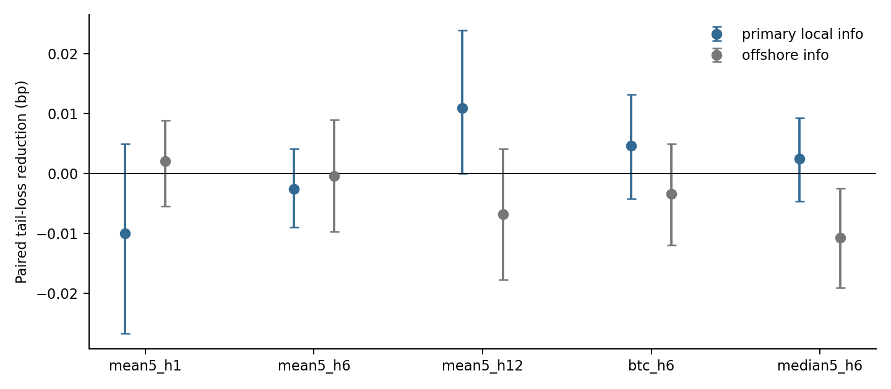
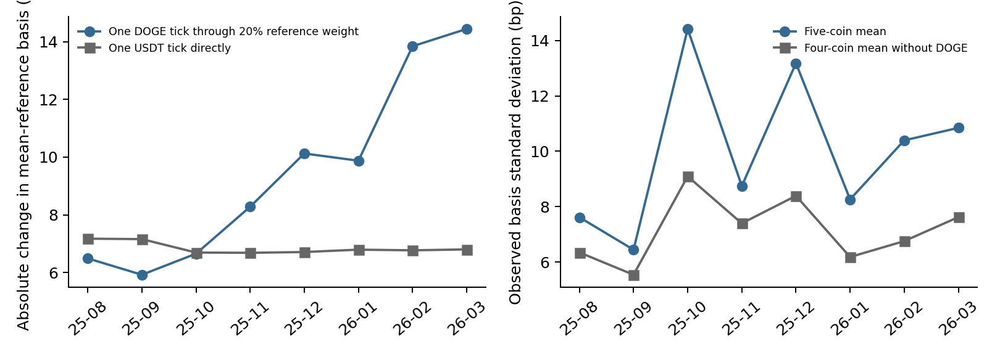

# Reference Sensitivity and Adaptive Tail Forecasting in Korean USDT Markets

## Abstract

Relative stablecoin prices depend on the asset prices used to construct a cross-market reference. We study this dependence jointly with forecast maintenance and the incremental information in offshore positioning. Using hourly Upbit and Binance observations from June 2025 to March 2026, we compare Korean USDT prices with implied KRW/USDT prices from Bitcoin and alternative five-asset references. Reference choice materially changes lower-tail labels: only 152 of 384 mean-reference lower-tail observations in early 2026 also breach the Bitcoin-reference threshold. A one-won DOGE price increment can move the equal-weight reference basis by more than a one-won USDT increment. In chronological six-hour forecasting over 1,837 observations, rolling error calibration raises linear-model central-80% coverage from 71.4% to 79.5% and reduces tail loss by 2.34%. A calibrated small boosting model has 2.60% higher loss than its linear counterpart; offshore positioning provides no consistent incremental improvement. The qualitative ranking survives alternative horizons and reference definitions. These exploratory results connect benchmark construction and forecast maintenance to the interpretation of learned market risk. They do not identify stablecoin-specific demand, causal tick-size effects, or executable arbitrage returns.

## 1. Introduction

Stablecoins connect cryptocurrency venues with different quote currencies, making their local relative prices relevant to price discovery and market integration. Korean USDT can be valued directly in won, or indirectly through a cryptocurrency traded in won domestically and in USDT internationally. The discrepancy between these valuations is a useful observable price-formation statistic. Its interpretation, however, depends on the reference asset: a movement in the discrepancy can originate from the stablecoin, the reference coin, or differences between the venues' observed transaction prices.

Recent research documents a tight equilibrium relationship and rapid adjustment between Korean Bitcoin and USDT premiums [1]. Nonlinear adjustment in the broader kimchi premium has also been established [2]. Separately, stablecoin tail forecasting with a quantile Transformer [3] and adaptive risk calibration for thousands of crypto-assets [4] show that neither nonlinear learning nor calibration is a new contribution by itself. Evidence that Korean venue-volume information can improve reinforcement-learning trading systems provides an additional reason to evaluate information sets explicitly [5].

We ask how reference construction, information selection, and model updating interact when forecasting the tails of Korean USDT relative prices. The contribution is an empirical evaluation that separates these choices. We compare a mean reference, a median reference, and Bitcoin; distinguish local market-state variables from offshore derivatives positioning; and apply the same delayed-feedback calibration to linear and tree-based forecasts. We retain negative comparisons, because an apparent improvement over a static or weak benchmark does not establish the economic value of a new information source.

Our strongest findings concern reference sensitivity and calibration. A low-priced reference asset with a coarse won price grid can materially affect a basis labeled as a stablecoin discrepancy. Once historical adaptation and calibration are included, the tested boosting model does not outperform simpler models. The study is an exploratory, reproducible case study of relative-price risk monitoring. It is not a new forecasting algorithm or a causal explanation of Korean stablecoin demand.

<!-- PAGEBREAK -->

## 2. Relative prices and reference-asset sensitivity

Let U_t be the Upbit KRW price of USDT, K_it the Upbit KRW price of coin i, and B_it its Binance USDT price. Its implied won price per USDT is R_it = K_it / B_it. For weights summing to one, define the basis in basis points as

```text
b_t(w) = 10,000 [log U_t - sum_i w_i log R_it].                 (1)
```

The main specification gives equal weight to BTC, ETH, XRP, SOL and DOGE. The alternative specifications use Bitcoin alone or the median of the five log implied prices. Common exchange-rate and USDT-dollar conversion terms cancel algebraically. Consequently, constructing these targets does not require an assumption that USDC is worth exactly one dollar or a time zone for a Bloomberg FX observation. This cancellation does not remove every economic influence of exchange rates or global markets.

The difference between the mean-reference and Bitcoin-reference bases is

```text
b_t(mean) - b_t(BTC)
  = -10,000 sum_i w_i [log R_it - log R_BTC,t].                 (2)
```

Equation (2) contains no domestic USDT price. Differences between these two measured stablecoin bases can therefore arise entirely from their reference assets. Under an illustrative latent decomposition log R_it = r_t + a_it and log U_t = r_t + s_t, the measured mean basis equals 10,000(s_t - mean_i a_it). Without identifying restrictions on a_it, neither this mean nor the median identifies the stablecoin-specific component s_t. Reference sensitivity is not automatically a data error: different references legitimately define different relative prices. It becomes an interpretation problem if a reference-specific component is attributed to USDT demand alone.

A discrete price grid makes the issue economically tangible. Holding every other observed price fixed, raising a reference coin's domestic price by one tick delta_i changes the mean basis by

```text
Delta b_i = -10,000 w_i log(1 + delta_i / K_it),
Delta b_USDT = 10,000 log(1 + delta_U / U_t).                   (3)
```

A reference asset can have a larger one-tick effect than USDT itself even with a weight of only 20%. This is an arithmetic sensitivity, not a price-impact estimate: actual simultaneous price changes, order queues and arbitrage responses are held fixed. It motivates reporting reference-asset and price-grid diagnostics before interpreting tail forecasts as stablecoin-specific risk.

Hourly closes are not synchronized executable quotes. The basis is neither an executable triangular arbitrage return nor a measure of USDT-dollar default or redemption risk. The forecast target is the basis at a future endpoint, not the minimum basis during the intervening hours.

<!-- PAGEBREAK -->

## 3. Data and chronological design

The supplied spot panels contain 6,983 hourly grid positions across June 2025 to March 2026 and 6,968 complete five-asset basis observations on 292 calendar days. We use Upbit OHLCV in KRW and Binance spot OHLCV in USDT. Five-minute Binance derivatives metrics provide account long/short ratios, top-trader position ratios, open interest and taker volume ratios; a separate series records funding payments. A high-low range is not treated as a bid-ask spread, and an offshore long/short ratio is not treated as observed Korean leverage or liquidation flow.

Cryptocurrency candle labels are shifted to their closing times. Each future target is connected on the complete hourly grid before observations with missing features are removed. Thus a six-hour target is always six clock hours ahead, regardless of intervening missing values. Derivatives metrics are assumed usable five minutes after their labels and are joined backward with a ten-minute maximum age. Funding payments are usable after five minutes and carried backward for at most nine hours. These delays are conservative operational assumptions rather than reconstructed publication-latency measurements.

Monthly forecasts begin in November 2025. At each monthly origin, fitting uses only observations whose target times are strictly earlier than that month. November and December provide a chronological calibration history. January through the available March observations form the main evaluation period. A parallel frozen-policy comparison fits at the January boundary and holds the model fixed afterward. All information sets within a target/horizon cell use identical complete observations. Zero-volume logarithms and other nonfinite inputs are excluded; positive extreme observations are retained.

| Reference | Horizon | Evaluation observations |
|---|---:|---:|
| Five-asset mean | 1 hour | 1,839 |
| Five-asset mean | 6 hours, primary | 1,837 |
| Five-asset mean | 12 hours | 1,831 |
| Bitcoin | 6 hours | 1,837 |
| Five-asset median | 6 hours | 1,837 |

The primary six-hour origins span January 1, 2026 at 22:00 UTC to March 19 at 10:00 UTC, with the last target at 16:00 UTC. These 1,837 overlapping forecasts represent 78 calendar days, not 1,837 independent market episodes. There are 200 monthly model-fitting specifications across the five cells and 117 scored policy/information/calibration configurations; this computational replication does not increase the independent market-history count.

The extension was specified after inspecting an earlier forecast pilot on the same overall period. The choices were fixed before evaluating this extension, including the three horizons, alternative references, calibration windows and primary comparisons. Nevertheless, the test period is not a pristine external holdout. Our results are exploratory chronological evidence, and robustness across definitions or time partitions cannot substitute for an independent market history.

<!-- PAGEBREAK -->

## 4. Learning, maintenance and evaluation

The price information set has 14 variables: the basis and its one- and six-hour changes; its 24-hour mean and standard deviation; Bitcoin returns at one and six hours, 24-hour volatility and downside variation; hour sine/cosine and weekend indicators; and trailing seven-day lower and upper deciles. The local set adds five variables: cross-coin implied-price dispersion, the domestic USDT high-low range, relative domestic/international coin volume, USDT volume surprise relative to the previous 24 hours, and an indicator for an unchanged USDT close. The full set adds seven offshore features: account long/short level and six-hour change, top-trader position ratio, one- and six-hour open-interest changes, a trailing-hour taker ratio and the last observed funding payment.

Linear quantile regressions [6] use training-only standardization and an L1 penalty of 0.01. The boosting specification is LightGBM [7], with seven leaves, 150 trees, learning rate 0.03, minimum leaf sample count 100 and L2 penalty 10. Its small fixed specification follows the earlier pilot; we do not select additional configurations using the present evaluation scores. Both families directly forecast the 0.1, 0.5 and 0.9 quantiles of the future basis level. Quantile outputs are sorted to prevent crossing.

Additional benchmarks are seven- and 28-day empirical basis quantiles; current basis plus the empirical distribution of completed horizon-specific changes; a local-feature threshold quantile model with training-derived hinges; and a six-variable quantile autoregression. The latter uses current and lagged basis, absolute basis, 24-hour scale and trailing-week deciles. These are operational dynamic benchmarks, not claimed replications of a complete structural TAR, VECM or CAViaR study.

For each fitted model, rolling error calibration adds the empirical tau quantile of previously issued forecast errors, y_s - q_tau,s, observed strictly before the current origin. Errors are retained for 28 calendar days, with at least 120 observations required. Six-hour labels cannot update a forecast until their six-hour outcomes have arrived. Fourteen- and 56-day windows are reported as sensitivity analyses. We apply the identical correction to linear and boosting models. This empirical rolling correction is related in motivation to adaptive uncertainty calibration [4,8], but it is not presented as a novel conformal method or as having distribution-free conditional coverage guarantees.

The primary loss is the mean pinball loss at the lower and upper deciles. We also report both tail exceedance frequencies, central-80% interval coverage and interval width. Primary comparisons pit the updated, calibrated local-feature tree against the identically calibrated local linear model, the 28-day empirical benchmark, and the calibrated price-only tree. Paired loss differences use 1,999 circular five-calendar-day block bootstrap samples. Centered-bootstrap approximate two-sided p-values receive Holm adjustment across these three comparisons. One- and ten-day blocks, six nonoverlapping origin phases, and removal of the one or five most favorable days are sensitivity checks. These intervals are conditional on the fitted procedure and observed period; unrestricted nonstationarity and researcher selection are not resolved.

<!-- PAGEBREAK -->

## 5. Forecast results

Table 1 reports the main six-hour comparison. Rolling error correction improves the linear model's tail loss from 1.7131 to 1.6730, a 2.34% reduction, with a paired loss-reduction interval of [0.0157, 0.0648] bp. Coverage rises from 71.42% to 79.53%. The improvement requires a wider average interval, increasing from 21.33 to 25.05 bp. For the tree, calibration reduces loss by 1.80% and raises coverage from 71.86% to 79.70%, with width increasing from 22.50 to 25.91 bp. Interval maintenance is useful, but its width cost must be reported.

| Table 1. Mean reference, 6 hours | Tail loss | Coverage | Width, bp |
|---|---:|---:|---:|
| Empirical history, 7 days | 1.7038 | 78.82% | 24.83 |
| Empirical history, 28 days | 1.6855 | 78.28% | 24.24 |
| Updated local linear | 1.7131 | 71.42% | 21.33 |
| Updated local linear + calibration | 1.6730 | 79.53% | 25.05 |
| Updated local tree | 1.7479 | 71.86% | 22.50 |
| Updated local tree + calibration | 1.7165 | 79.70% | 25.91 |
| Updated full tree + calibration | 1.7170 | 78.77% | 25.75 |

The calibrated local tree has 2.60% higher loss than the calibrated local linear model. Expressing improvement as reference loss minus candidate loss, the difference is -0.0435 bp, with interval [-0.0702, -0.0184] and approximate Holm-adjusted p = 0.0015. The local-information addition changes tree loss by only -0.149% in improvement units, with an interval spanning zero. Adding offshore positioning changes calibrated tree loss by -0.026% in improvement units, also spanning zero. These comparisons do not support the predicted information advantage.



The calibrated tree underperforms the calibrated local linear model in all five target/horizon cells, by 1.33% to 3.28%. Its mean-reference six-hour loss is higher in January, February and the observed part of March. Its difference remains negative across all six nonoverlapping origin phases, although two phase-specific intervals include zero. The calibrated linear model is only 0.74% better than the 28-day empirical benchmark, with an interval including zero. We therefore do not claim a robust algorithmic advantage even for the best-performing displayed linear specification.

<!-- PAGEBREAK -->

## 6. Reference-dependent risk labels and price grids

Reference choice changes both tail magnitude and which timestamps are considered risky. On the 1,865 complete observed basis timestamps in early 2026, thresholds fixed at each reference's pre-2026 lower decile produce 384 mean-reference breaches and 279 Bitcoin-reference breaches. Only 152 overlap: 39.6% of the mean-reference breach set, and a Jaccard overlap of 0.297. These are observed-price diagnostics, not the 1,837 forecast-origin sample, and their thresholds differ because each reference has its own historical distribution.

Individual episodes make the distinction explicit. At the December 1, 2025 17:00 UTC candle end, the mean-reference basis is -93.35 bp, the median-reference basis -7.31 bp, and the Bitcoin-reference basis -1.03 bp. The same domestic USDT observation is paired with reference-coin bases of -159.63 bp for SOL and -294.34 bp for DOGE. On October 10 at 22:00 UTC, the mean-reference basis is -241.21 bp while the Bitcoin-reference basis is +141.30 bp. These diagnostic examples establish sensitivity of interpretation, not which reference is the unobserved fair price.

Upbit's policy history supplies context for the price grid [9-11]. In June and July the supplied USDT and DOGE closes include fractional won prices; from August onward both are integer-valued. The July 31 KRW-market policy introduced a one-won tick for DOGE's relevant price band. For post-reform observations, equation (3) permits a deterministic sensitivity comparison without estimating a policy effect.



In February, DOGE's median price is KRW 144 and USDT's is KRW 1,476. A one-won DOGE move changes the 20%-weighted mean basis by approximately 13.84 bp in absolute value; a direct one-won USDT move changes it by 6.77 bp. Across the early-2026 common observations, the mean-reference basis standard deviation is 9.72 bp, compared with 6.76 bp for the four-coin mean excluding DOGE. Removing another individual constituent raises rather than lowers the five-coin standard deviation. This leave-one-out result and equation (3) motivate scrutiny of low-price reference assets, but they do not identify the share of variance caused by rounding: genuine coin-specific premia and non-synchronous trades remain possible explanations.

<!-- PAGEBREAK -->

## 7. Interpretation, limitations and contribution

The findings support three limited insights. First, learning the tail of a relative-price index does not by itself establish that the learned risk is specific to the stablecoin. Reference-asset discrepancies can change tail membership and even the sign of a large observation. A multi-asset reference is not automatically a cleaner measure than a single liquid benchmark. Its weights, asset prices and quote increments affect the economic meaning of the target.

Second, forecast maintenance and information acquisition are distinct interventions. Rolling error correction improves risk-frequency alignment within both tested model classes. Monthly tree refitting provides a further 1.02% reduction relative to the frozen calibrated tree, but the maintained tree still trails the maintained linear model. The data therefore support an improvement in a forecasting procedure without supporting a nonlinear-algorithm premium. A strong recent-history benchmark captures much of the available performance. This matters for AI evaluation: a gain against a stale risk estimate can otherwise be misattributed to algorithmic complexity or additional finance features.

Third, the tested offshore signals do not have stable incremental value for this task. Their addition is approximately neutral in the primary cell and does not improve results consistently across horizons or references. This is a bounded negative finding about account/position ratios, open-interest changes, taker activity and funding at the available frequency. It is not evidence that offshore derivatives never influence Korean markets, nor an equivalence test excluding all economically relevant effects.

The contribution differs from documenting average Bitcoin-USDT parity [1], nonlinear kimchi-premium adjustment [2], dollar-peg tail prediction [3], or broad cryptocurrency VaR calibration [4]. It links the definition of a local relative-price risk label to a controlled comparison of information and maintenance choices. Tick-size effects on cryptocurrency market quality are already established [12]; our one-tick calculation concerns the propagation of a reference coin's price increment into a stablecoin-labeled index, not a new causal result about optimal ticks. The combination is an empirical contribution candidate rather than a claim to be the first study of benchmark sensitivity or adaptive prediction.

Limitations are material. The evaluation covers only 78 days in one venue pair and reuses a period considered in a preliminary study. Overlapping targets, changing feature distributions and numerous secondary comparisons restrict inference. The bootstrap conditions on observed forecasts and does not fully propagate model fitting and design selection. Alternative references are different estimands; lower dispersion does not prove better measurement of latent fair value. Hourly closing prices cannot identify sub-hour adjustment, quoted depth, executable spreads or transfer-constrained arbitrage profits. The July policy coincides with other market changes, so the present design does not estimate its causal effect. Generalization to later periods, other venues or crises remains unverified.

## 8. Reproducibility and conclusion

The analysis package records input and specification hashes, all chronological forecasts, training cutoffs, full score tables, secondary windows and inference sensitivities. Independent timing checks verify that future outcomes cannot affect current calibration and that a long calendar gap does not preserve stale errors. Figure data are supplied as CSV files. Raw input provenance is retained locally; code and derived results form the reproducibility package for author review.

The results establish a practical requirement for this setting: specify which relative price is being monitored and distinguish information value from forecast maintenance. They justify further work on reference-aware risk monitoring, while providing no basis for claiming that the tested boosting model or offshore positioning outperforms strong adaptive benchmarks.

<!-- PAGEBREAK -->

## References

1. Kang, C.-M., Kang, H.-G., Kim, D., and Sul, H. K. (2025). Stablecoin and cross-border crypto market integration. *Economics Letters*, 257, 112704. [Publisher](https://doi.org/10.1016/j.econlet.2025.112704).

2. Seo, M. H., Koo, B., and Yang, Y. F. (2024). Nonlinear dynamics of Kimchi premium. *Economic Modelling*, 135, 106726. [Publisher](https://doi.org/10.1016/j.econmod.2024.106726).

3. Lee, M. C. (2026). Stablecoin risk – a hybrid Copula-GARCH–QT framework for early warning, tail quantiles, and co-depeg dynamics. *North American Journal of Economics and Finance*, 85, 102654. [Publisher](https://doi.org/10.1016/j.najef.2026.102654).

4. Fantazzini, D. (2024). Adaptive Conformal Inference for Computing Market Risk Measures: An Analysis with Four Thousand Crypto-Assets. *Journal of Risk and Financial Management*, 17(6), 248. [Full text](https://doi.org/10.3390/jrfm17060248).

5. Han, D., and Kim, Y. J. (2026). Enhancing Reinforcement Learning-Based Crypto Asset Trading: Focusing on the Korean Venue Share Indicator. *Systems*, 14(1), 111. [Full text](https://doi.org/10.3390/systems14010111).

6. Koenker, R., and Bassett, G., Jr. (1978). Regression Quantiles. *Econometrica*, 46(1), 33-50. [Publisher](https://doi.org/10.2307/1913643).

7. Ke, G., et al. (2017). LightGBM: A Highly Efficient Gradient Boosting Decision Tree. *Advances in Neural Information Processing Systems*, 30. [Proceedings](https://proceedings.neurips.cc/paper/2017/hash/6449f44a102fde848669bdd9eb6b76fa-Abstract.html).

8. Gibbs, I., and Candes, E. (2021). Adaptive Conformal Inference Under Distribution Shift. *Advances in Neural Information Processing Systems*, 34. [Proceedings](https://proceedings.neurips.cc/paper/2021/hash/0d441de75945e5acbc865406fc9a2559-Abstract.html).

9. Upbit Developer Center (2025). USDT/KRW and USDC/KRW tick-unit change, effective March 21. [Official notice](https://docs.upbit.com/kr/kr/changelog/usdtkrw_tick_unit_change).

10. Upbit Developer Center (2025). KRW-market tick-unit policy change, July 31. [Official notice](https://docs.upbit.com/kr/changelog/krw_tick_unit_change_250731).

11. Upbit Developer Center. KRW-market order price units and minimum order amount. [Official guide](https://docs.upbit.com/kr/docs/krw-market-info). Policy history and current table consulted September 2026.

12. Dyhrberg, A. H., Foley, S., and Svec, J. (2023). When Bigger Is Better: The Impact of a Tiny Tick Size on Undercutting Behavior. *Journal of Financial and Quantitative Analysis*, 58(6), 2387-2416. [Publisher](https://doi.org/10.1017/S0022109022001077).
